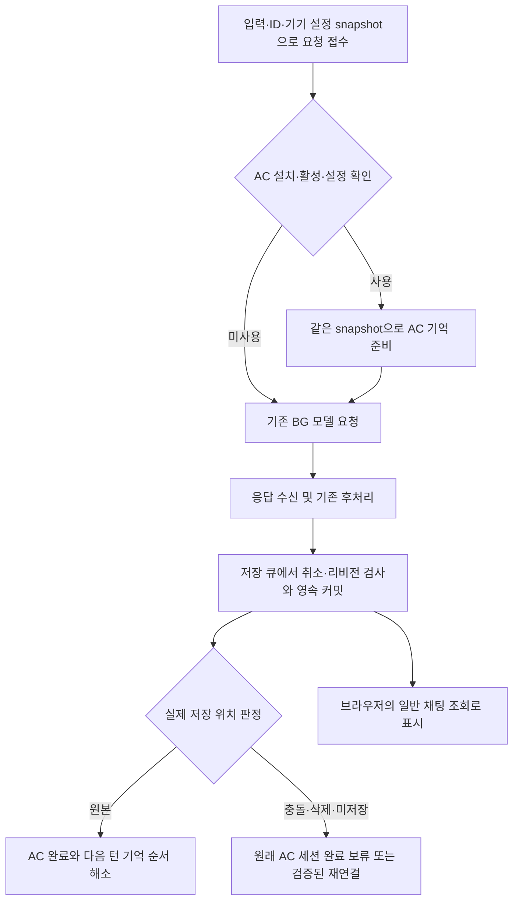

# BG Preserve: 서버 채팅 자동 저장과 Archive Center 자동 연동 계획서

작성일과 최근 개정일은 2026-09-13이며, 상태는 **구현 전 계획**이랍니다. 이 문서는 요구사항·설계 방향·작업 순서·검증 기준을 정리한 것이며, 구현이나 배포를 승인하거나 완료했다는 의미는 아니랍니다. 검증하지 않은 로컬 수정 초안의 방식은 확정 설계로 취급하지 않는답니다.

이 문서에서 **AC**는 [Archive Center](https://github.com/Flazer31/archive-center)를 뜻한답니다.

## 1. 목표

**사용자가 요청을 보낸 뒤 브라우저를 완전히 종료하더라도, Ubuntu의 PocketRisu가 살아 있는 동안 서버가 생성·후처리·해당 채팅 저장을 완료하도록 만드는 것**이 목표랍니다. 이후 사용자는 평소처럼 해당 세션을 열어 이미 저장된 답변을 확인하기만 하면 된답니다.

기존 BG Preserve를 유지하며, AC가 설치·활성화·설정돼 있다면 별도 BG 연동 설정 없이 기억 처리까지 서버 실행 흐름에 연결하는 범위랍니다.

## 2. 대상과 범위

- PocketRisu 1.10.0 + PocketRisu Personal Patches 0.2.1을 기준으로 한답니다.
- PocketRisu와 AC 백엔드는 같은 Ubuntu 서버에서 실행하는 구성으로 사용자가 확인했답니다.
- AC는 앞서 검토한 4.3.1 소스를 설계 기준으로 삼으며, 실제 구현 시 지원할 플러그인·백엔드 조합을 명시적으로 고정한답니다.
- AC의 고정 커밋 `026dcbf3b45adcf69b254673d439b24e943115b3`과 패처의 고정 커밋 `3e69349d3b0ca3bf8011b597e080880238e5fa0a`를 소스 대조 기준으로 삼는답니다. 이 대조는 계약 확인이며, 실제 Ubuntu 연동 성공을 뜻하지 않는답니다.
- 기존 BG 생성·스트리밍 보존 기능을 유지한답니다.
- AC가 설치·활성화되고 기본 설정을 마쳤다면 별도 BG 연동 토글 없이 기존 설정으로 연결한답니다.
- 서버가 생성 요청을 접수한 뒤에는 브라우저를 완전히 종료해도 서버가 생성·후처리·PocketRisu 채팅 저장을 완료해야 한답니다.
- 브라우저 복귀는 이미 저장된 채팅의 조회이며, 사용자의 확인이나 복구 버튼이 저장을 시작하는 조건이 되어서는 안 된답니다.
- 생성 중 PocketRisu 프로세스 자체가 종료된 경우의 임의 시점 재개는 이번 요구에 포함하지 않는답니다. 이미 저장된 채팅의 지속성은 기존 DB 저장 계약으로 유지한답니다.

서버의 생성 요청 접수가 독립 실행의 시작점이랍니다. 접수되기 전에 브라우저가 종료되어 서버로 전달되지 않은 요청까지 실행하는 기능은 포함하지 않는답니다.

범용 외부 플러그인 실행기, 별도 채팅 DB, 복구 전용 화면, 신규 상주 브라우저는 이번 계획에 포함하지 않는답니다. 기존 구조에서 해결할 수 있는 기능부터 재사용하는 원칙이랍니다.

## 3. 현재 코드에서 확인한 차이

현재 BG 서버 실행 대상으로 들어간 요청은 브라우저 연결과 독립적으로 생성과 후처리를 실행하고 응답을 KV에 보관한답니다. 다만 `persistOrchResult()`가 쓰는 것은 BG 결과 레코드이며, 브라우저의 `persistMergedOrchestrationResult()`가 그 결과를 채팅에 병합하고 `requestDurableSave()`를 수행한 뒤 ACK하는 구조랍니다.

따라서 수정의 중심은 모델 수신 기능 신설이 아니라, 정상 생성 결과의 채팅 저장 책임을 서버로 옮기는 것이랍니다. 기존 결과의 보관 기한이나 브라우저의 재방문 여부가 채팅 저장 여부를 결정해서는 안 된답니다.

근거는 패처 고정 커밋 `3e69349d3b0ca3bf8011b597e080880238e5fa0a`의 `patches/bg-preserve.json`과 `patches/lazy-chat-sync/files-1.10/server/node/server.cjs`랍니다.

또한 현재 서버 생성 번들은 브라우저에서 등록한 AC 플러그인 훅을 자동으로 실행하지 않는답니다. 따라서 서버 채팅 저장과 AC 실행 연결은 각각 해결해야 하는 두 작업이랍니다.

## 4. 목표 실행 순서

1. 브라우저가 입력을 서버에 저장하고, 안정적인 캐릭터·채팅 ID·시작 리비전·요청 correlation과 **요청한 기기에서 읽은 AC 유효 설정 snapshot**을 포함한 생성 요청을 접수시킨답니다.
2. 서버가 작업 ID에 입력·설정 snapshot·AC 실행 소유자를 결합한답니다. AC 미설치·비활성·미지원 상태에서는 그 사실을 기록하고 기존 BG 경로를 사용한답니다.
3. AC가 활성화돼 있으면 서버용 AC 어댑터가 같은 설정 snapshot으로 기존 Go API를 호출하여 세션·턴을 해석하고 기억을 준비한답니다. 기억 정책이나 선정 알고리즘은 AC Go 백엔드에 그대로 둔답니다.
4. BG가 기억을 포함한 실제 모델 요청을 보내고, 응답 수신·기존 후처리를 완료한답니다. 스트리밍 여부에 상관없이 최종 응답을 얻는 공통 완료 지점이 필요하답니다.
5. 서버가 짧게 점유한 기존 저장 큐 안에서 리비전·취소 상태를 다시 확인하고 최종 채팅·필요한 메타데이터를 커밋한답니다. 커밋 결과에는 요청한 채팅 ID가 아니라 **실제로 저장된 채팅 ID·리비전·원본/충돌/미저장 판정·부분별 반영 상태**가 포함돼야 한답니다.
6. 실제 저장 위치와 일치하는 최종 응답만 AC 완료 후보로 삼는답니다. 원본 채팅에 정상 커밋된 경우에만 준비한 세션을 그대로 완료하고, 충돌 채팅은 검증된 재연결 계약이 있을 때만 새 세션으로 연결하며, 그 밖에는 원래 세션 완료를 보류한답니다.
7. 채팅 본문 저장 완료와 AC 기억 준비 완료를 별도 상태로 기록한답니다. 같은 AC 세션의 다음 요청은 앞 작업의 AC 순서 정책이 해소된 뒤 기억을 준비하며, AC 실패 때문에 이미 생성한 본문이나 모델 요청을 다시 실행하지 않는답니다.
8. 브라우저가 살아 있으면 저장된 결과를 자동 반영하고, 완전히 종료돼 있었다면 다음 실행의 일반 채팅 로딩에서 같은 결과를 읽는답니다. 서버가 AC 실행을 소유한 작업은 기존 브라우저 훅이 중복 처리하지 않는답니다.

브라우저의 조회나 결과 ACK는 `F`의 실행 조건이 아니랍니다. AC가 응답 본문을 변환하는 처리는 최종 채팅 저장 전에 반영하고, 기억 영속화에 필요한 완료 처리는 저장된 본문과 일치하도록 연결해야 한답니다.

작업 상태는 적어도 `chat_committed`, 변수·통계 등 `effects_committed`, `ac_settled`, `ready_for_next_turn`을 구분해야 한답니다. 사용자에게 답변을 표시할 수 있는 시점과 다음 턴이 최신 채팅·변수·AC 기억을 사용할 수 있는 시점은 같은 완료 상태가 아니랍니다. 1단계에서는 각 effect가 다음 턴 prompt에 영향을 주는지까지 분류하여 `ready_for_next_turn`의 정확한 의존 상태를 확정한답니다.

## 5. 서버 저장 변경

기존 `queueStorageOperation`, `chatWriteJournal`, `fullChatStore`, `persistCurrentChatStore`, DB 캐시·ETag 갱신 기능을 활용하는 방향이랍니다. 별도의 채팅 데이터베이스나 복구 전용 저장 화면은 필요하지 않답니다.

`chat_committed`의 선형화 지점은 1단계에서 하나로 고정한답니다. 현재 우선 후보는 저장 큐 안에서 리비전 전제조건을 통과하고 `chatWriteJournal.stage()`의 durable write가 성공한 뒤 `fullChatStore`에 같은 payload를 게시한 시점이랍니다. 다만 **debounced 전체 DB 저장 전에 프로세스를 종료해도 저널 복원으로 같은 채팅 ID·본문·리비전이 돌아오는 실패 주입 시험**을 통과해야 이 지점을 영속 완료로 인정한답니다. 이 계약을 증명하지 못하면 `persistCurrentChatStore()`의 strict 완료까지 기다리는 쪽으로 장벽을 옮긴답니다. 단순히 전체 DB 저장을 예약했다는 사실은 저장 완료가 아니랍니다.

새 충돌 채팅처럼 새 metadata stub이 필요한 저장은 payload 저널만 복구되는 것으로 완료 판정하지 않는답니다. 재시작 뒤 정상 채팅 목록과 일반 조회 경로에서 실제 저장 ID를 발견할 수 있도록 metadata까지 durable하거나 저널 복구가 metadata를 재구성해야 한답니다. 이를 증명하지 못하면 새 채팅의 `chat_committed`는 metadata를 포함한 전체 DB 저장 뒤에만 전이한답니다.

서버 커밋에는 작업 ID와 결과 리비전을 연결하여 중복 실행·결과 재조회가 같은 답변의 재삽입이나 통계 재가산으로 이어지지 않게 해야 한답니다. 작업 ID 하나만 존재하는 것으로는 충분하지 않답니다. 채팅 본문, 전역 변수 변경·삭제, 통계를 각각 식별 가능한 effect와 `pending`·`committed` 상태로 기록하고, 재시도는 이미 커밋된 effect를 건너뛴 채 남은 부분만 처리해야 한답니다. 모델 생성과 후처리는 이 재시도에 포함하지 않는답니다.

채팅 본문 성공 뒤 변수·통계 또는 작업 완료 레코드가 실패하는 각 경계에 실패를 주입하여, 재시도 후 본문·변수·통계가 정확히 한 번만 반영되는지 검증한답니다. 가능한 부분은 같은 저장 트랜잭션에 묶고, 소유 저장소가 달라 원자화할 수 없는 부분은 durable per-effect ledger와 재개 순서로 해소한답니다. 부분 성공을 전체 성공으로 표시하지 않는답니다.

모델 호출, 스트림 대기, 후처리, AC `/prepare-turn`·`/complete-turn` 네트워크 요청은 기존 저장 큐를 점유하지 않는답니다. 큐 안에는 최신 상태 읽기, 리비전·취소 판정, journal/DB 및 effect 커밋처럼 짧고 직렬화가 필요한 구간만 둔답니다.

일반 완료 경로에서는 브라우저가 확인하기 전에 저장이 완료돼야 한답니다. 저장 실패·사용자 취소·대상 채팅 삭제·동시 편집 충돌을 원래 채팅의 정상 저장 완료와 혼동하지 않도록 해야 한답니다. 이미 존재하는 중간 결과 전달 기능도 최종 서버 커밋을 오래된 중간 결과로 덮어쓰지 않도록 맞춰야 한답니다.

취소와 커밋의 승패는 같은 operation 상태의 직렬화된 전이로 결정한답니다. 커밋 선형화 전에 취소가 먼저 확정되면 정상 채팅과 AC 완료를 만들지 않고, `chat_committed` 뒤의 늦은 취소는 이미 저장된 답변을 취소로 다시 표시하거나 삭제하지 않는답니다. 커밋 결과는 `requestedChatId`, `storedChatId`, `storedRevision`, `storageDisposition`(`original`·`conflict_copy`·`not_stored`), `conflictReason`, 각 effect 상태를 반환하는 계약으로 구체화한답니다.

근거는 패처 고정 커밋 `3e69349d3b0ca3bf8011b597e080880238e5fa0a`의 `patches/lazy-chat-sync/files-1.10/server/node/server.cjs` 5145~5163행이랍니다.

## 6. 브라우저 복귀 변경

서버 커밋이 확인된 새 결과는 기존의 ‘결과 병합 → 서버에 다시 저장’ 경로를 실행해서는 안 된답니다. 최신 서버 채팅과 리비전을 읽고 로컬 저장 기준을 갱신하는 경로가 필요하답니다. 이를 하지 않으면 중복 답변·불필요한 충돌 채팅·오래된 본문의 재업로드가 생길 수 있답니다.

새 클라이언트·새 서버의 저장 계약은 명시적으로 식별하고, 기존 결과 형식은 기존 복구 경로에서 처리하는 편이 타당하답니다. 프로젝트의 기존 client-build-fence도 유지하여 구형 탭의 쓰기를 막아야 한답니다. ACK는 새 계약에서 채팅 저장의 전제조건이 되어서는 안 된답니다.

2단계 서버와 3단계 클라이언트는 개발·테스트 commit을 나눌 수 있지만 **한 호환 배포 단위**로 전달한답니다. 새 서버 커밋 계약을 모르는 클라이언트가 재병합하거나, 새 클라이언트가 아직 저장하지 않는 서버 결과를 조회 전용으로 오인하지 않도록 계약 버전·build fence·legacy fallback을 양쪽에서 함께 검증한답니다.

같은 브라우저의 오래된 캐시뿐 아니라 로컬 캐시가 없는 새 브라우저에서도 결과를 확인해야 한답니다. 생성 요청을 보낸 브라우저에 남은 복구 표식이 없더라도, 일반 채팅 조회만으로 저장된 답변이 보여야 한답니다.

## 7. AC 자동 연동 변경

AC 전용 서버 어댑터로 범위를 제한한답니다. 임의의 Risu 플러그인 JS를 Node에서 실행하는 범용 로더는 이번 요구에 필요하지 않답니다.

어댑터는 설치된 AC의 식별·지원 버전·활성화 상태를 확인하고, 요청을 시작한 기기에서 AC 자체의 우선순위로 해석한 유효 설정을 재사용해야 한답니다. AC 설정은 장치 로컬 저장이 우선이고 세이브 내 값은 migration·compatibility mirror이므로, 서버가 mirror의 최신값을 해당 요청의 설정이라고 간주해서는 안 된답니다.

브라우저는 요청 접수 전에 AC의 기존 설정 읽기 경로에서 최소 allowlist snapshot을 만들고, 설정 schema/version과 digest를 작업에 결합해야 한답니다. `/prepare-turn`과 `/complete-turn`은 생성 도중 다른 기기나 탭에서 설정이 바뀌더라도 이 동일 snapshot을 사용한답니다. 비밀값은 필요한 전송 구간 밖의 결과 레코드·로그에 복제하지 않고, snapshot이 없거나 검증되지 않으면 stale mirror나 임의 기본값을 추측해 자동 연동 성공으로 표시하지 않는답니다. 서로 다른 설정을 쓰는 두 기기의 요청은 전역 last-writer-wins 설정으로 합쳐져서는 안 된답니다.

요청 전 세션·턴 관측, `/prepare-turn` 호출과 반환된 주입 계획 적용, 최종 응답의 `/complete-turn` 처리가 AC의 기존 계약과 일치해야 한답니다. AC의 재검색·평론가·출판사 정책을 패처에 복제하지 않고, 가능한 호스트 변환 로직을 공통으로 사용해야 한답니다. 브라우저의 설정창과 HUD는 계속 브라우저가 담당한답니다.

현재 브라우저의 `beforeRequest`·`afterRequest` 훅을 서버에 단순 복사하는 것으로 완료를 가정해서는 안 된답니다. 스트리밍 완료, 추가 모델 호출, 후처리로 변경된 최종 본문, 실제 저장 시점의 순서를 먼저 검증해야 한답니다. 서버에서 확인한 수신·저장 사실과 브라우저의 표시 확인도 구분하며, 관측하지 않은 표시 이벤트를 만들어 전달하지 않는답니다.

AC Go의 고정 소스는 완료 요청에서 source-acceptance 계약 버전과 세션·본문 hash를 검사한답니다. 특히 `source_acceptance_observation.v3`은 `risu_host_lifecycle_observation.v1`, `risu_afterRequest`, `received_final_response`, `matched_before_request_context`, `archive_center_request_correlation_id`의 일치를 요구한답니다. 서버 저장 완료는 Risu의 `afterRequest` 표시 관측이 아니므로 이 값을 만들어 보내서는 안 된답니다.

1단계에서 설정 전달 → `/prepare-turn` → 모델 대신 고정 응답 → 서버 채팅 커밋 → `/complete-turn`의 최소 연동 실험을 수행한답니다. 기존 v1·v2·v3 계약 중 하나가 **서버가 실제 관측한 사실만으로** 수용되는지 positive/negative fixture와 Go 응답으로 증명한답니다. 표현할 수 없다면 4단계 산출물에 AC Go의 새 versioned source-observation 계약, DTO·수용/거부 판정·멱등성 테스트와 최소 JS 호스트 어댑터 변경을 포함한답니다. 패처만 바꾸면 된다고 미리 가정하지 않는답니다.

서버가 생성 요청을 인수한 뒤에는 그 작업의 AC prepare/complete 최종 호출자도 서버 하나로 고정한답니다. correlation과 server-owned marker를 받은 브라우저 훅은 같은 작업을 다시 처리하지 않되, 일반 foreground 요청과 legacy 결과의 기존 AC 훅은 유지한답니다. 인수 전 실패·인수 후 실패의 owner handoff와 재시도 주체도 1단계에서 표로 확정한답니다.

커밋 결과의 실제 저장 위치를 AC session binding의 입력으로 사용한답니다. `storageDisposition=original`이고 준비한 세션과 실제 채팅 ID가 일치할 때만 기존 세션을 완료한답니다. `conflict_copy`이면 원래 세션 A에 완료를 기록하지 않고, AC가 명시적으로 지원하는 branch/new-session 연결을 실험으로 검증했을 때만 실제 저장 채팅 B에 연결한답니다. 그 계약이 없으면 생성 본문은 B에 보존하되 AC 완료는 `blocked_conflict`로 남긴답니다. 삭제·취소·미저장 결과도 AC 완료를 보내지 않으며, 이미 수행한 prepare를 보류·폐기·재연결하는 AC의 기존 계약까지 확인한답니다.

어댑터를 패처만의 변경으로 제공할 수 있는지, AC 쪽에 재사용 가능한 호스트 진입점이 필요한지는 위 실험의 판정으로 결정한답니다. 임의의 설치된 플러그인 스크립트를 Node에서 실행하는 방식이나 검증 전 로컬 초안의 실행 방식은 이 문서에서 채택하지 않는답니다.

AC의 현재 턴/이전 턴 저장 정책은 PocketRisu 채팅 자체의 즉시 저장과 구분해야 한답니다. 사용자 설정이 이전 턴 확정이라면 AC 기억 확정 시점을 조용히 바꾸지 않고 기존 정책에 따라야 한답니다.

같은 AC 세션의 다음 입력은 서버가 접수할 수 있지만, 이전 작업이 `ready_for_next_turn`에 도달하기 전에는 새 `/prepare-turn`을 앞질러 실행하지 않는답니다. 이전 턴 즉시 완료, 다음 host signal에서 확정, 재시도 가능한 지연, terminal 실패 각각에서 언제 다음 기억 준비를 허용할지 AC 기존 정책과 함께 결정한답니다. 이 순서 대기는 저장 큐나 다른 채팅의 요청을 막지 않으며, AC 미사용 작업에는 적용하지 않는답니다. 브라우저가 계속 열려 있거나 종료 후 복귀했는지와 무관하게 server-owned 작업의 기억 주입·완료는 서버만 담당한답니다.

근거: [AC 설정 저장 계약](https://github.com/Flazer31/archive-center/blob/026dcbf3b45adcf69b254673d439b24e943115b3/Archive%20Center.js#L4363-L4525), [AC 완료 source-acceptance 검증](https://github.com/Flazer31/archive-center/blob/026dcbf3b45adcf69b254673d439b24e943115b3/go-service/internal/httpapi/complete_turn_source_acceptance.go#L347-L528), [AC 호스트·백엔드 역할](https://github.com/Flazer31/archive-center/blob/026dcbf3b45adcf69b254673d439b24e943115b3/docs/permanent-risu-host-backend-boundary.md).

## 8. 예외 처리 원칙

| 상황 | 처리 방향 |
|---|---|
| AC 미설치·비활성 | 기존 BG 생성과 새 서버 채팅 저장을 수행 |
| AC 설정 snapshot 누락·미지원 버전 | stale mirror나 임의 기본값으로 대체하지 않고 자동 연동 성공으로 표시하지 않으며, 기존 오류 처리와 일치하는 동작을 구현 전에 확정 |
| AC 전처리 실패 | AC의 기존 실패 정책을 확인해 적용하고, 기억 없이 진행된 요청을 정상 연동으로 오인하지 않도록 처리 |
| AC 완료 처리 실패 | 저장된 채팅을 유지하고, 원래 모델 요청 재실행 없이 AC의 기존 재시도·멱등성 계약 활용 |
| 채팅 성공 후 변수·통계·완료 기록 실패 | 부분별 durable 상태를 유지하고, 모델 재호출 없이 미완료 effect만 재시도 |
| 최종 채팅 저장 실패 | 성공 또는 전달 완료로 표시하지 않고 생성 결과를 보존하며, 서버 측 저장 재시도 경로 마련 |
| 생성 중 다른 탭에서 같은 채팅 수정 | 리비전 비교 후 기존 충돌 보존 규칙 적용; 커밋 결과에 실제 충돌 채팅 ID를 기록하고 원래 AC 세션 완료는 금지 |
| 생성 중 대상 채팅 삭제 | 삭제된 원래 채팅을 자동 복원하지 않으며, 미전달 결과의 보존·정리를 기존 정책과 함께 명시하고 AC 완료는 보내지 않음 |
| 저장 전 사용자 취소 | 이후 결과가 정상 답변으로 되살아나지 않도록 취소 상태와 커밋 순서를 보장 |
| 저장 후 사용자 취소 | 이미 저장된 답변을 취소했다고 표시하지 않으며, 완료 상태와 취소 가능 시점을 일치시킴 |
| 재조회·ACK 유실·반복 재접속 | 이미 저장한 답변·통계·AC 완료 처리를 중복 적용하지 않음 |
| AC 완료 지연 중 같은 세션의 다음 입력 | 요청은 보존하되 이전 AC 순서 정책이 해소되기 전에 다음 기억 준비가 앞지르지 않음 |
| 다른 설정의 두 기기·상시 열린 브라우저 | 각 작업이 시작 기기의 snapshot을 끝까지 사용하고 server-owned 작업의 AC prepare/complete가 한 번만 실행됨 |

채팅 저장과 AC 백엔드 저장은 별도 시스템의 작업이므로 하나의 원자적 트랜잭션으로 가정하지 않는답니다. 각각의 완료 여부를 구분하고, 기존 작업 식별자와 AC 멱등성 키를 활용하여 재시도가 중복 처리로 이어지지 않게 한답니다.

## 9. 작업 순서와 단계별 산출물

### 1단계: 변경 계약 확정

- 정확한 대상 소스에서 서버 생성·후처리·결과 보관·채팅 저장의 호출 순서를 정리한답니다.
- TTS·이미지·감정 표현 등 현재 브라우저 실행을 요구하는 경로와, 주 모델 이외의 추가 호출을 조사한답니다. 필요한 후처리가 브라우저 복귀까지 멈추는 경로는 해결하거나 지원 범위를 명시한 뒤 다음 단계로 진행한답니다.
- 요청 기기의 AC 유효 설정을 읽어 allowlist snapshot으로 전달하고, 동일 snapshot으로 준비와 완료를 수행하는 최소 연동을 검증한답니다.
- AC Go가 서버 관측 사실을 기존 source-acceptance 계약으로 받아들이는지 확인하고, 성공 fixture뿐 아니라 `risu_afterRequest` 등 관측하지 않은 값을 꾸민 fixture가 거부되는지도 확인한답니다. 기존 계약으로 불가능하면 필요한 새 Go 계약과 테스트 범위를 확정한답니다.
- 저장 완료 선형화 지점을 정하고, durable journal 직후·전체 DB flush 전 종료 복원, 본문 뒤 effect별 실패, 취소/커밋 race를 실패 주입으로 검증한답니다.
- 커밋 결과의 실제 저장 채팅 ID를 기준으로 원본·충돌·삭제·미저장과 AC 완료/재연결/보류를 교차한 결정표를 확정한답니다.
- 같은 AC 세션에서 이전 완료 지연과 다음 입력이 겹칠 때의 `ready_for_next_turn` 전이, server/browser 최종 호출자, 인수 전후 실패의 재시도 주체를 확정한답니다.
- 2·3단계를 함께 배포할 계약 버전과 구형 client/server 조합의 fail-closed·legacy 동작을 확정한답니다.
- 산출물은 변경 대상 목록과 실행 순서뿐 아니라 **최소 연동 request/response 증거, source-acceptance 판정, 저장/effect 실패 주입 결과, 충돌-AC 결정표, 설정 snapshot schema·소유권표, 다음 턴 상태 전이표, 지원·미지원 조건**이랍니다. 이 항목 중 하나라도 미확정이면 구현 단계에서 임의로 결정하지 않는답니다.

### 2단계: 서버의 정상 채팅 저장

- 기존 저장 큐·저장소·충돌 병합 로직을 재사용하여 최종 결과를 채팅에 영속 저장한답니다.
- 작업 식별자와 실제 저장 위치, 부분별 effect ledger를 연결하고, 본문·변수·통계의 한 번만 반영되는 동작과 취소 선형화를 검증한답니다.
- 산출물은 AC 없는 상태에서도 브라우저 종료 후 서버 저장이 완료되는 변경과 테스트랍니다.

### 3단계: 클라이언트 자동 반영

- 서버 저장이 확인된 결과를 기존의 재병합·재저장 경로에서 분리한답니다.
- 최신 채팅 조회와 로컬 저장 기준 갱신을 연결하며, 다른 채팅의 편집을 유지한답니다.
- 산출물은 일반 재접속·반복 새로고침·새 기기 접속에서 중복 없이 답변을 표시하는 변경과 테스트랍니다.

2단계와 3단계는 독립 commit으로 회귀를 격리하되, 호환 gate를 함께 통과한 뒤 하나의 배포 단위로만 적용한답니다.

### 4단계: AC 전용 연동

- 설치·활성화·지원 버전·설정을 확인하고 서버의 요청 전후 처리에 연결한답니다.
- 실제 모델 요청에 기억이 포함되는지, 저장된 최종 답변이 실제 저장 채팅 ID에 대응하는 AC 세션과 턴에 연결되는지 검증한답니다.
- 서버와 브라우저의 AC 중복 실행 방지, 요청별 설정 snapshot, 같은 세션의 다음 턴 barrier를 검증한답니다.
- 산출물은 필요한 패처 변경과, 1단계에서 필요성이 확인된 경우의 AC JS 호스트 어댑터 및 **AC Go 관측·검증 계약과 테스트 변경**이랍니다.

### 5단계: 패처 통합 및 Ubuntu 검증

- 확정된 변경을 기존 패처의 소유 파일·어댑터 구조에 편입하고 정확한 대상 버전에서 전체 패치 조합이 성립하는지 확인한답니다.
- 클라이언트와 BG 서버 번들을 함께 빌드하고, 취소·동시 편집·오류·구형 결과 복구에 관한 회귀 검증을 수행한답니다.
- 별도 테스트 데이터로 같은 Ubuntu 서버 구성에서 브라우저 종료 시나리오를 검증한답니다.
- 산출물은 검토 가능한 변경분, 테스트 결과, 설치·업데이트·되돌리기 절차랍니다. 실사용 서버 적용은 이 계획서 작성 범위에 포함하지 않는답니다.

주요 검토 위치는 아래와 같으며, 파일 추가 여부와 정확한 수정 지점은 1단계에서 확정한답니다.

| 영역 | 주요 검토 위치 |
|---|---|
| 서버 생성·결과 수명주기 | `server/node/bgOrchestrator.cjs`, BG 작업 상태·결과 전달 헬퍼 |
| 정상 채팅 저장·캐시 | `server/node/server.cjs`, 기존 채팅 저장 저널 및 리비전 검사 |
| 브라우저 복귀·병합 | `src/ts/bgOrchestrate.ts`, BG 병합·전달·변수 헬퍼 |
| 로컬 저장 기준·채팅 로딩 | `src/ts/globalApi.svelte.ts`, `src/ts/storage/chatStorage.ts` |
| 서버 번들·AC 훅 연결 | `server/node/bgOrchBundle.build.cjs`, `Archive Center.js`의 호스트 어댑터 영역 |
| 패처 배포 | BG Preserve 및 Lazy Chat 관련 매니페스트·어댑터·기존 검증 절차 |

## 10. 검증 기준

| 시나리오 | 통과 기준 |
|---|---|
| 요청 접수 후 브라우저 완전 종료 | 브라우저를 한 번도 다시 열기 전에 서버 DB/API에서 최종 채팅 응답을 확인 |
| durable journal 성공 직후·전체 DB flush 전 프로세스 종료 | 재시작 뒤 같은 채팅 ID·본문·리비전 복원; 새 충돌 채팅은 정상 목록에서도 발견; 불가능하면 그 지점을 저장 완료로 사용하지 않음 |
| AC 전처리 도중 종료 | 서버에서 기억 준비 후 모델 생성까지 계속 진행 |
| 모델 스트리밍 도중 종료 | 스트림 종료·후처리·채팅 저장이 모두 서버에서 완료 |
| 응답 후처리 도중 종료 | 후처리된 최종 본문이 요청을 보낸 채팅에 저장 |
| 새 브라우저 또는 로컬 캐시 없는 기기에서 접속 | 복구 조작 없이 동일한 저장 응답 표시 |
| 여러 번 새로고침·결과 재조회 | 답변·통계·AC 완료 처리의 중복 반영 없음 |
| 채팅 기록 성공 후 변수·통계·작업 완료 기록 각각 실패 | 모델 재호출 없이 미완료 effect만 재시도하고 답변·변수·통계 중복 없음 |
| AC 미설치·비활성 | 기존 BG 생성과 새 서버 채팅 저장이 정상 동작 |
| AC 활성·지원 버전 | 실제 모델 요청에 AC 기억이 포함되고, 최종 응답이 올바른 AC 세션에 연결 |
| 기존 AC source-acceptance 계약 최소 연동 | 실제 서버 관측값만 담은 완료 요청의 수용/거부가 기록되고, 관측하지 않은 `risu_afterRequest` 표시를 꾸민 요청은 사용하지 않음 |
| AC 완료 처리 실패 | PocketRisu에 저장된 답변 유지, 모델 재생성 없이 해당 연동 실패만 처리 |
| 충돌 채팅 B 생성 후 AC 완료 처리 | 원래 채팅 A의 AC 세션에 B의 답변이 들어가지 않으며, 검증된 재연결이 없으면 `blocked_conflict`로 보존 |
| 다른 채팅으로 이동·다른 탭의 수정·취소 | 저장 대상 혼동·기존 편집 덮어쓰기·취소 응답 부활·미저장 결과의 AC 완료 없음 |
| AC 완료 지연 중 같은 세션의 다음 입력 접수 | 정한 순서 정책대로 이전 완료/terminal 판정 뒤 다음 기억을 준비하고 저장 큐·다른 세션은 차단하지 않음 |
| 서로 다른 설정의 두 기기와 브라우저 상시 접속 | 각 요청의 설정 digest가 시작 기기의 snapshot과 일치하고 prepare/complete가 작업별 한 번만 실행 |
| 비스트리밍 응답·스트리밍 응답 | 두 방식 모두 최종 수신과 채팅 저장 완료 지점으로 연결 |
| AC의 다음 입력 시 기억 확정 설정 | 채팅은 즉시 저장하되 AC 기억 확정 시점은 기존 설정 유지 |
| 임시 BG 결과 정리 이후 접속 | 정상 저장된 채팅은 결과 보관 기한과 무관하게 조회 가능 |
| 저장 완료 후 PocketRisu 재시작 | 기존 정상 채팅 저장소에서 답변 복원; 실행 중 작업 재개와 구분 |

모의 서버·단위 테스트 결과와 실제 Ubuntu에서의 검증 결과는 구분해서 기록한답니다. 실제 연동을 실행하지 않은 경로는 검증 완료로 표시하지 않는답니다.

최종 완료 판정에는 **브라우저를 다시 열기 전에 서버의 정상 채팅 데이터에 최종 답변이 저장됐다는 증거**가 필요하답니다. 재접속한 뒤 답변이 나타나는 현상만으로는 이 요구의 충족을 판정하지 않는답니다.
