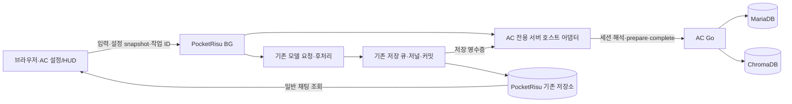

# PocketRisu 1.10 × Archive Center 상세 통합 계획

> 2026-09-24 계획 순서 개정: [BG Preserve 순차 목표 계획](BG-PRESERVE-ORDERED-GOALS.md)이 실행 순서와 목표별 완료 조건의 정본이다. 이 문서의 C0~C7, H0~H7 일괄 통합·활성화 순서는 기존 설계와 검증 항목을 설명하는 역사적 구조로 남긴다. C1·C2·C3 및 H1의 PocketRisu 구현·증거는 G1에 재배치하고, 공식 AC 원본과의 호환성은 G2, 브라우저 없는 AC 처리까지의 완주는 G3에서 각각 검증한다. G1·G2의 기본 경로에 AC JS·Go·스키마 변경을 포함하지 않는다. G3도 공식 AC의 기존 API를 사용하는 별도 연결 패치를 먼저 실험하며, 원본 변경은 순차 목표 계획 §5의 근거와 별도 범위 결정이 필요하다. 본문에서 달리 읽히는 이전 권고는 기술적 가설·실험 설계이지 현재 구현 지시나 완료 판정이 아니다.

작성·소스 확인: 2026-09-13 KST  
상태: **설계 제안 / 구현·통합 시험·배포 전**  
개정: **r2 — 비판적 검수 P1 5건·P2 2건 반영**  
상위 요구사항: [NAI Studio의 BG Preserve 원문 계획](https://github.com/danso0429/nai-studio/blob/fbd06c0d52532b3dedeaf985cb9ce9aa333cbd2c/docs/POCKETRISU-1.10-BG-PRESERVE-SERVER-CHAT-SAVE-ARCHIVE-CENTER-PLAN.md)

이 문서는 상위 계획의 요구사항을 실제 소스에 대응시킨 실행 설계랍니다. **PocketRisu가 채팅과 생성 작업을 소유하고, AC Go가 기억과 턴 판정을 소유하며, 둘 사이에 AC 전용 호스트 어댑터를 두는 방식**을 권고하와요. 브라우저 종료 후에도 생성·후처리·채팅 저장·설정에 맞는 AC 처리가 서버에서 이어지는 것이 목표랍니다.

NAI Studio는 이번 계획서가 보관된 저장소다. 순차 목표의 기본 수정 대상은 PocketRisu 개인 패처와 그 패처가 만드는 실행 코드다. AC JS·Go 변경 제안은 원본 AC와 별도 연결 패치의 기존 계약을 시험한 뒤에만 재검토한다.

아래에서 **확인**은 고정 소스를 직접 읽은 사실, **제안**은 이번 문서에서 구체화한 설계, **검증 필요**는 구현 실험이나 실제 Ubuntu 시험이 남은 항목을 뜻한답니다. 새 필드·계약명·함수명은 별도 표시가 없더라도 제안이며, 현재 API에 이미 존재한다고 해석해서는 안 된답니다.

검수본 `POCKETRISU-1.10-ARCHIVE-CENTER-PLAN-CRITICAL-REVIEW.md`의 일곱 지적을 고정 로컬 소스와 다시 대조했답니다. 모두 설계 보완 대상으로 채택했으며, 문장 보완과 시험 통과를 구분한답니다. **r2는 아래 규칙을 제안으로 확정한 개정판이며, P1이 실증으로 해결됐다는 판정은 C0의 실패 시험 뒤에만 내릴 수 있답니다.**

| 검수 항목 | r2에서 정한 연결 규칙 | 본문·검증 위치 |
|---|---|---|
| P1-1 실행권 | Go의 binding 재검증·원자적 claim, fenced token, 모든 종료 이유의 settle | §10.2~10.3, T21·T28 |
| P1-2 변경 전달 순서 | PocketRisu 저장에 결합한 durable 전달 의도, host 변경 순번, AC 수용·안전 반영 경계 | §8.4, T11·T22 |
| P1-3 prepare 관측 | canonical 입력 영수증과 실제 조립 payload의 별도 서버 관측, 의미 판정 검사 | §7.4, T17·T18 |
| P1-4 prepare 유실 | 유료 실행 전 durable prepare key/fingerprint, 상태 조회, 무주입 작업의 명시적 AC skip | §11.1~11.2, T05·T22 |
| P1-5 대기 입력 | 채팅 선저장 이전 명령 접수, 서버 queue 순번·예상 변경 계보, 입력 1회 연결 | §10.1, C3·C6, T19·T20 |
| P2-1 출력 변환 | AC 순수 출력 변환을 요청별 seed로 서버의 대응 after-response 위치에 적용 | §7.5, T04·T24 |
| P2-2 소유권 발견 | 정상 채팅 조회와 같은 revision의 메시지별 owner projection, 결과 TTL과 분리 | §12.1, T13×T27 |

## 1. 기준과 완료 조건

| 대상 | 고정 기준 | 이번 확인 범위 |
|---|---|---|
| 원문 계획 | NAI Studio `fbd06c0d52532b3dedeaf985cb9ce9aa333cbd2c` | 지정 문서 전문 |
| PocketRisu | 공식 `v1.10.0`, `98e968339d1b3f91b9dac85bb3f2ebb5f90f9d14` | 요청 훅, API v3 타입·저장 접근, Node DB 코드 |
| 개인 패처 | `0.2.1`, `3e69349d3b0ca3bf8011b597e080880238e5fa0a` | BG 매니페스트·버전 어댑터, 저장 코드, 저널, 결과·변수·통계 헬퍼, PageFold 어댑터 |
| AC | 4.3.1 기반, `026dcbf3b45adcf69b254673d439b24e943115b3` | JS 설정·주입·완료 경로, Go 설정·턴·source acceptance·멱등성 경로 |
| 실행 환경 | PocketRisu와 AC가 같은 Ubuntu 서버에서 실행 | 상위 문서에서 사용자가 확인한 배치 조건; 이번 작업에서 서버 접속 시험은 수행하지 않았답니다 |

패처와 AC의 확인 시점 HEAD는 상위 문서의 고정 커밋과 일치한답니다. 패처의 BG 원본 JSON만 읽지 않고 `manifest.cjs`가 1.10용으로 변환하는 owned unit도 추출해 대조했답니다. 다만 전체 패치 그래프를 실제 PocketRisu에 적용·빌드한 증거는 아직 없답니다.

아래는 기존 일괄 통합의 최종 통과 기준이다. 순차 목표에서는 1~3번의 AC 독립 BG 결과를 G1에서, 공식 AC 원본 호환을 G2에서, AC 서버 완주를 포함한 4~5번의 통합 결과를 G3에서 각각 별도 증거로 닫는다.

최종 통과 기준은 다음과 같답니다.

1. 서버가 작업을 인수한 뒤 브라우저 프로세스를 완전히 종료해도 최종 본문이 정상 채팅 저장소에 기록되어야 한답니다.
2. 브라우저를 다시 열기 **전에** 서버의 일반 채팅 API·저장 자료로 본문과 저장 리비전을 확인해야 한답니다.
3. 로컬 캐시가 없는 새 브라우저에서도 일반 세션 열기만으로 같은 답변이 보여야 한답니다.
4. AC 활성·지원·정상 연결 조합에서는 실제 모델 요청의 기억 주입과, 실제 저장된 본문에 대한 AC 완료를 확인해야 한답니다. 장애 시 §11.2의 명시적 skip은 성공 완료와 구분하여 검증한답니다.
5. ACK 유실·재조회·연동 재시도가 본문·변수·통계·AC 원문의 중복 반영을 만들지 않아야 한답니다.

생성 중 PocketRisu 프로세스 자체가 종료된 작업의 임의 시점 재개, 범용 외부 플러그인 실행기, 별도 채팅 DB, 상주 브라우저, 새로운 복구 전용 화면은 범위에 포함하지 않는답니다.

## 2. 소스 대조로 구체화된 차이

| 확인한 사실 | 통합 설계에 미치는 영향 | 근거 |
|---|---|---|
| BG의 `persistOrchResult()`는 결과 KV를 저장하고, 브라우저의 `persistMergedOrchestrationResult()`가 병합·durable save·ACK를 수행 | 결과 KV 완료와 정상 채팅 커밋을 분리하고 서버 커밋을 추가해야 한답니다 | [P1], [P2] |
| 채팅 저장은 저널을 먼저 기록한 뒤 `fullChatStore`에 게시하고 전체 DB 저장을 예약 | 저널의 복구 가능성, metadata, effect 기록까지 포함한 실제 완료 장벽을 증명해야 한답니다 | [P3], [P4] |
| `restoreInto()`는 저널 payload를 `chatStore`에 복원하지만 새 채팅 metadata를 생성하지 않음 | 충돌 사본의 본문만 저널에 있어서는 정상 채팅 목록에서 발견된다고 보장할 수 없답니다 | [P4] |
| BG 번들의 DB·선택 캐릭터 상태가 singleton이라 `_previewLock`으로 실행을 직렬화 | AC의 이전 작업 대기를 이 잠금 안에 넣으면 다른 채팅도 막히므로, 대기와 실행 잠금의 범위를 나누어야 한답니다 | [P1], [P2] |
| `ttsAutoSpeech`, `viewScreen=emotion/imggen`은 브라우저 epilogue를 요구한다고 판정 | 이 조합을 서버 완주 지원으로 오인하면 안 되며, 별도 지원 검증 전에는 기존 foreground 분류를 유지해야 한답니다 | [P1] |
| AC 설정은 장치 로컬 우선이며 save의 `pluginStorage`는 이관·mirror 역할 | 요청한 기기의 AC가 직접 해석한 설정을 받아야 한답니다 | [A1], [R2] |
| JS의 `/config/update` 동기화와 Go의 runtime config·전처리 설정 파일 읽기가 존재 | 작업마다 전역 설정을 바꾸는 방식으로는 두 기기의 설정 격리를 보장하지 못한답니다 | [A2], [A3] |
| AC 완료 v2·v3는 Risu 호스트 신호를 요구하고, v1도 활성 채팅 관측을 전제 | 서버 커밋 사실을 표현하는 명시적 계약이 우선 설계 후보랍니다 | [A5] |
| `source_acceptance_required`가 없으면 `legacy_unobserved` 경로가 존재 | 이 검사를 끄고 통과시키는 방식은 지원되는 통합 증거로 인정하지 않는답니다 | [A5] |
| `save_ok`는 AC canonical raw-turn의 영속 경계이며 파생 기억 실패는 별도 | 다음 턴 준비 가능 여부를 `save_ok` 하나로 결정해서는 안 된답니다 | [A6] |
| 공식 요청 코드의 before 훅 뒤에 request trigger와 모델 요청이 있고 재시도 루프에서도 훅이 실행 | AC 주입 계획은 한 번 준비하고, 실제 전송 직전 payload를 별도로 확인해야 한답니다 | [R1] |
| prepare는 canonical 입력 출처·payload 관측을 별도로 검사하며 HTTP 200에서도 source를 억제할 수 있음 | complete v4와 별도의 prepare host 계약과 의미 판정이 필요하답니다 | [A10] |
| AC afterRequest에는 표시 정제·prefill 제거가 포함 | 훅의 저장 부작용을 끄더라도 순수 출력 변환을 서버 대응 위치에 남겨야 한답니다 | [A11] |
| BG 인수 전 클라이언트가 이미 삽입한 입력을 durable save | N+1 대기를 지원하려면 입력 삽입·자동 저장 이전의 명령 접수 경로가 필요하답니다 | [P1], [P2] |

**2026-09-24 재분류:** 당시의 패처 + AC JS/Go 보완 권고는 통합 일괄 구현 가설이다. 이후의 H2 AC 확장과 H3 로컬 AC 수정도 공식 AC 원본의 기존 계약으로 동일한 사용자 효과를 낼 수 없다는 증거가 아니다. 현재 기본 경로는 G1 BG 독립 완성 → G2 공식 AC 원본 호환 → G3 공식 AC 기존 API를 이용한 서버 완주다. 특정 AC 변경이 불가피한지는 순차 목표 계획 §5의 원본 왕복 실험으로 판정한다.

## 3. 역할과 배포 구조

> 다음 구조도는 G3까지 모두 연결된 경우의 목표 구조다. G1은 PocketRisu BG·저장·일반 클라이언트만으로 성립해야 하며, G2의 별도 연결 패치가 AC 전용 책임을 맡는다. G1/G2의 기본 산출물에 수정한 AC JS·Go를 넣지 않는다.



| 책임 | 소유자 | 구현 원칙 |
|---|---|---|
| 설치·활성 상태, 장치 설정 읽기 | 브라우저의 AC 플러그인 | 기존 설정 우선순위와 sanitize 함수 재사용 |
| 작업 인수, 입력 보존, 생성·취소·서버 채팅 저장 | PocketRisu | 기존 BG 작업·저널·DB 소유자 확장 |
| 실제 요청·최종 본문·저장 사실 관측 | AC 서버 호스트 어댑터 | 관측·변환·통신만 담당 |
| 세션·논리 턴·branch·source 수용 판정 | AC Go | Node에서 턴 번호 산식이나 세션 연결 정책 복제 금지 |
| 검색·예산·출판사·평론가·전처리·기억 저장 | AC Go | 현재 4.3.1 기억 동작을 보존 |
| 주입 계획의 실제 payload 적용 | 실행 중인 PocketRisu 호스트 어댑터 | Go가 만든 텍스트·계획을 정확히 적용 |
| 표시·설정창·HUD | 브라우저 | 서버 결과를 조회하여 표시 |

PocketRisu와 AC는 DB를 공유하지 않는답니다. PocketRisu의 채팅 저장과 AC의 원문·기억 저장 사이에 분산 트랜잭션이 존재한다고 가정하지 않는답니다. 전송 대기 기록은 기존 BG operation 저장을 확장하고, 범용 메시지 브로커나 새 job 시스템은 만들지 않는답니다.

AC의 서버 URL은 기존 유효 설정을 사용하며 포트 `28080`을 강제로 넣지 않는답니다. 연결 대상의 버전·인스턴스 식별을 확인해 브라우저 설정이 가리키던 AC와 같은 백엔드인지 검증한답니다. 동일 Ubuntu라도 URL·프록시·컨테이너 경로를 임의로 추측해 치환하지 않는답니다.

## 4. 정상 실행 순서

> 다음 11단계는 이전 일괄 통합 시나리오의 상세 설계다. G1은 AC 단계 1·4·6~8·10을 선행 조건으로 삼지 않고 BG 실행·채팅 저장·복원 흐름을 독립적으로 검증한다. G2는 공식 AC 원본과 실제 충돌을 확인하고, G3는 공식 API 왕복 실험으로 AC 단계의 구현 위치와 필요성을 다시 결정한다.

1. **지원·설정 판정:** AC 초기화와 지원 capability를 확인하고 요청 기기의 유효 snapshot을 취득한답니다. 아직 초기화되지 않은 플러그인을 미설치로 처리하지 않는답니다.
2. **명령 인수:** 새 서버 계약은 브라우저가 사용자 메시지를 canonical DB에 삽입·선저장하기 **전**에 분기한답니다. 서버가 입력 명령·ID·관측 기준·설정·queue 순번을 durable 기록하면 인수 완료랍니다. 브라우저는 pending 표시만 유지한답니다.
3. **Node 채팅 차례 취득:** Node가 해당 채팅 queue의 head operation을 원자적으로 예약한답니다. AC off에도 적용하며, 이 예약은 저장 큐 자체를 계속 점유하는 lock이 아니랍니다.
4. **AC binding·실행권 취득:** 안정 host chat ID로 Go routing을 요청하고, 같은 transaction/CAS에서 현재 binding 재검증과 session claim 취득을 수행한답니다. `wait`면 저장 큐·`_previewLock` 밖에서 대기한답니다. 이전 턴 모드에서는 새 입력 접수가 먼저 앞 작업의 확정 신호가 된답니다.
5. **입력 연결:** Node가 예상 predecessor 변경 계보를 확인하고 입력 변환을 한 번 수행한 뒤, canonical 사용자 메시지·input receipt·변경 순번을 커밋한답니다. 아직 차례가 아닌 N+1의 메시지를 앞서 연결하지 않는답니다.
6. **서버 prepare 관측:** 해당 입력 receipt와 현재 canonical 메시지를 기준으로 번들의 실제 주 모델 payload를 관측한답니다. fenced claim·host 변경 경계를 첨부해 prepare를 보내며, v3 브라우저 이벤트를 만들지 않는답니다. logical turn은 이 관측에서 Go가 해석한답니다.
7. **prepare 판정·주입:** stable prepare key로 유실·중복을 조정하고 HTTP 코드와 별도로 입력 판정·주입 자격·plan을 확인한답니다. 준비 결과를 채택하거나 §11.2의 명시적 무주입 skip 중 하나를 Node에 고정한답니다.
8. **모델·출력 변환:** 주입 계획을 attempt별로 적용하고 실제 전송 자료를 확인한답니다. 응답 수신 뒤 AC 출력 정제·prefill 제거를 대응 위치에서 수행하고, 기존 PocketRisu 후처리·최종 replacement를 마친답니다.
9. **채팅·전달 의도 커밋:** 저장 큐에서 취소·revision·삭제를 재검사하여 본문·metadata·effects·source 변경 전달 의도·owner 기록을 함께 보존한답니다. 실제 저장 ID·revision·host 변경 순번을 영수증으로 반환한답니다.
10. **AC 완료 또는 중단:** 준비가 채택된 정상 원본은 설정에 맞게 complete하고, 실패·취소·충돌·무주입 skip은 reason이 있는 settle을 전달한답니다. 순번 누락·이전 worker 무효화를 해소한 뒤 Go가 실행권을 해제한답니다. 이 전달·순서 대기는 저장 큐와 번들 잠금 밖에서 진행한답니다.
11. **조회·다음 작업:** 브라우저는 같은 revision의 본문과 owner projection을 함께 조회한답니다. 새 작업은 `ready` 조회만 믿지 않고 자신만의 claim을 취득해야 한답니다. 표시·ACK는 9번이나 10번의 시작 조건이 아니랍니다.

서버 번들의 전체 실행은 현재 `_previewLock` 때문에 직렬화되어 있답니다. 이번 변경에서 보장할 것은 **AC 후속 완료 대기 때문에 그 잠금을 추가로 붙잡지 않는 것**이며, 여러 채팅의 모델 호출 병렬화를 새로 제공한다는 뜻은 아니랍니다.

실행권 취득 뒤 편집이 끼어들어 prepare 시점의 fence가 달라지면 Go는 즉시 `stale_claim`/`source_not_synced`를 반환한답니다. 잠금 안에서 다른 세션 작업의 해소를 기다리지 않고 해당 실행을 중단·settle한답니다. 이미 입력에 적용한 script·변환을 새 prepare 재시도 명목으로 다시 실행하지 않는답니다. 일반 prepare 네트워크 처리는 현재 번들 실행 구간에 남을 수 있지만, 별도의 세션 순서 대기를 그 안에 넣지는 않는답니다.

## 5. 작업·저장 영수증 계약

다음은 필드 수준의 **신규 제안**이랍니다. 기존 `operationId`, `resultId`, `publishSeq`, `baseChatRevision`과 결과 보관 규칙을 활용하며, 형식 버전을 별도로 붙인답니다.

```ts
type ServerChatCommitReceipt = {
  contractVersion: 'bg_server_chat_commit.v1';
  operationId: string;
  resultId: string;
  publishSeq: number;
  requestedCharId: string;
  requestedChatId: string;
  storedChatId: string | null;
  baseChatRevision: string;
  storedRevision: string | null;
  bindingEpoch: string;
  hostChangeSeq: number;
  inputReceiptId: string;
  claimEpoch: number | null;
  storageDisposition: 'original' | 'conflict_copy' | 'not_stored';
  conflictReason: string | null;
  finalContentHash: string;
  chatCommitted: boolean;
  effects: {
    chat: EffectReceipt;
    metadata: EffectReceipt;
    globals: EffectReceipt;
    stats: EffectReceipt;
  };
  acOwner: 'server' | 'disabled';
  acState: string;
  readyForNextTurn: boolean;
};

type EffectReceipt = {
  status: 'pending' | 'committed' | 'skipped' | 'conflict' | 'failed';
  effectId: string;
  reason?: string;
};
```

`chatCommitted`는 `storageDisposition`과 함께 해석한답니다. 충돌 사본 B가 저장되면 `chatCommitted=true`일 수 있지만 원본 A에 정상 반영되었다는 의미는 아니랍니다. 미저장에서는 `storedChatId`·`storedRevision`을 채워 넣지 않는답니다.

| 식별자 | 의미와 고정 규칙 |
|---|---|
| `operationId` | 사용자 생성 명령의 수송·재접속 식별자; 인수 응답 유실에도 유지 |
| `attemptId` | 실제 모델 후보·재시도 식별자; AC의 논리 턴과 구분 |
| `resultId`·`publishSeq` | 중간·최종 결과의 버전; 최종 커밋 뒤 낮은 순서의 결과 반영 금지 |
| `requestedChatId` | 요청 시작 위치; 실제 저장 위치를 대신하지 않음 |
| `storedChatId`·`storedRevision` | 서버 커밋이 확인한 위치와 내용 버전 |
| AC `chat_session_id`·`turn_index` | AC routing·turn-resolution 결과; 메시지 수를 둘로 나눈 값으로 대체 금지 |
| `archive_center_request_correlation_id` | 주 모델 요청과 AC 준비·완료를 연결 |
| `settingsDigest` | 비밀을 제외한 장치 snapshot 및 비공개 credential 참조를 연결하는 감사 값 |
| `executionContextId` | Go가 고정한 실제 실행 설정과 준비 결과의 참조; 신규 계약 |
| `hostInstanceId`·`bindingEpoch` | 서버 설치와 AC route binding의 세대; 재연결·분기를 새 세대로 구분 |
| `hostChangeSeq` | 해당 host chat binding의 durable 변경 순번; hash나 시각과 별개 |
| `claimEpoch` | Go가 부여한 session 실행권 세대; 이전 소유자의 늦은 쓰기 차단 |
| `inputCommandId`·`inputReceiptId` | 대기 명령 및 canonical 입력의 한 번 연결을 증명하는 기록 |
| `prepareKey`·`prepareFingerprint` | 유료 준비 시작 전 고정한 동일 요청 식별자와 의미 내용 hash |

인수 상태를 조회했는데 불명확한 경우에는 새로운 ID로 재생성하지 않는답니다. 서버의 기존 operation 상태를 확인하고 `not-started`가 확정된 경우에만 기존 fallback 규칙으로 넘기는답니다.

## 6. 요청별 설정 snapshot과 실제 설정 격리

### 6.1 장치 설정과 백엔드 설정의 구분

**확인:** AC JS의 `readSettingsPersistentValue()`·`loadSettings()`가 장치 저장소와 이관 경로를 해석하고, `syncConfigToBackend()`는 `/config/update`를 호출한답니다. Go의 `supervisorLLMConfig()`와 `completeTurnExtractionConfig()`는 runtime config를 읽으며 전처리는 `memory-preprocessing.json`을 읽는답니다. 그러므로 snapshot을 받았다는 사실만으로 격리가 완성되지 않는답니다. [A1] [A2] [A3]

**제안:** 장치 snapshot과 Go의 실행 설정을 다음처럼 고정한답니다.

| 구성 | 취득·고정 시점 | 내용 |
|---|---|---|
| 장치 snapshot | 요청 기기의 AC 초기화 완료 후, 서버 인수 전 | AC enable 상태·적용 모드·설정 schema·정규화된 요청 옵션 |
| 기기별 provider 설정 | 같은 시점 | 기존 `resolveEffectiveCriticConfig`, provider override 정규화 결과를 재사용 |
| 백엔드 공통 설정 | 첫 AC prepare에서 Go가 일관된 snapshot으로 취득 | 서버에만 존재하는 전처리 설정·공통 기본값·관련 prompt 설정 |
| 최종 실행 설정 | 첫 prepare에서 한 번 해석 | 명시적 장치 값과 공통 설정을 기존 우선순위로 합성한 immutable context |
| complete·평론가·관련 재처리 | 앞 실행 컨텍스트 참조 | 이후 전역 설정 변경을 다시 읽어 덮어쓰지 않음 |

백엔드에서 공통 관리하는 전처리 설정을 새롭게 ‘장치별 설정’으로 바꾸지는 않는답니다. 다만 해당 작업이 사용한 공통 설정 리비전은 첫 prepare 시점에 고정하고, 장치 snapshot과 함께 추적해야 한답니다. 이 시점 차이는 영수증에 기록한답니다.

### 6.2 allowlist

| 묶음 | 기존 설정 예시 | 처리 |
|---|---|---|
| 적용·확정 | `pluginMainApplyMode`, `injectionEnabled`, `turnFinalizationMode` | 의미와 끔·shadow·live 구분 보존 |
| 기억 예산 | `maxInjectionChars`, `memoryDeliveryBudgetMode`, `memoryDeliveryBudgets`, `maxInputContextChars` | 기존 정규화 경로에서 실제 필드·기본값 확인 후 고정 |
| 원작·로어북 | `referenceInjectionMaxChars`, `lorebookReferenceMaxChars`, `lorebookReferenceMode`, `primaryCanonBaseMaxChars`, `topK` | 주 기억 예산과 분리; topK를 일반 기억 전체 제한으로 재해석하지 않음 |
| 기억 전송 | `memoryTransportMode` | 텍스트/PDF·Provider Manager 적용 경로와 함께 검증 |
| 모델·평론가 | `pluginMain*`, `subLlm*`, effective critic 및 provider override 결과 | 기기에서 해석한 값을 실행 컨텍스트로 전달 |
| 계층화 | episode·chapter·arc·saga interval | prepare와 complete가 같은 값을 사용 |
| host 관측 | persona, 요청 역할, 활성 채팅 메시지, 지원되는 로어북 snapshot·언어 관측 | 정확한 호스트 타입에 따라 수집; 설정과 원문 관측을 구분 |

목록의 wildcard는 전체 객체 복사를 허용하는 의미가 아니랍니다. 구현 시 기존 요청 빌더가 사용하는 정확한 키를 열거하여 JSON schema를 고정한답니다. 알려지지 않은 실행 필드는 거부하거나 호환 규칙대로 무시하되 임의로 Go에 전달하지 않는답니다.

### 6.3 Go 변경안

> 이 절은 기존 H2/C4 확장의 설계 근거다. 공식 AC 원본에서의 G2 호환성이나 G3 서버 왕복을 위해 Go 변경이 필요하다고 확정한 지시는 아니다. 원본의 설정 우선순위와 기존 API를 실측한 뒤 적용 여부를 판단한다.

기존 `/prepare-turn`에 versioned execution-context 입력·응답을 추가하는 안을 우선한답니다. Go가 provider·평론가·임베딩·전처리·관련 prompt 설정을 한 번 해석하고 `executionContextId`와 비밀 제외 digest를 반환하도록 한답니다. `/complete-turn`과 이후 해당 작업의 재처리는 같은 context를 참조한답니다.

현재 요청마다 `s.runtimeConfigSnapshot()`·`s.loadMultiAgentSettings()` 등을 다시 읽는 실행 경로에는 그 immutable context를 전달한답니다. context는 §11.1의 durable prepare key에 결합하므로 응답 유실 후 새 context를 다시 만들지 않는답니다. 기존 설정창의 전역 저장 기능은 유지하며, 작업 실행을 위해 전역 설정을 바꿨다가 복원하는 방식은 채택하지 않는답니다. context 안의 provider 함수도 기존 Go 소유자를 재사용한답니다.

Go의 참조 context는 소유 세션·operation·settings digest와 결합하고 다른 작업이 빌려 쓰지 못하게 검사한답니다. 새 범용 설정 서버나 별도 비밀 DB는 만들지 않는답니다. 실제 저장 구조는 기존 source lineage·pending/reprocessing 기록을 먼저 검토하여 선택한답니다.

비밀값은 인증된 전송·실행 메모리에 한정하며 결과 응답·공용 로그·HUD·일반 채팅 metadata에 기록하지 않는답니다. 공개 digest에 API 키 자체의 단순 hash를 넣지 않는답니다. 다음 입력 확정 모드에서도 필요한 context는 확정 전 임의 TTL로 버리지 않는답니다.

**재시작 경계:** 실행 컨텍스트의 비밀 참조가 서버 재시작으로 사라졌다면 새 전역 설정으로 조용히 완료하지 않고 `settings_context_unavailable`로 기록한답니다. 이미 커밋된 본문은 유지하고 모델은 재생성하지 않는답니다. 재시작 뒤 AC 후속 처리까지 무인 복원한다고 주장하려면 기존 credential·reprocessing 저장 구조로 동일 context를 복원하는 별도 시험이 필요하답니다.

## 7. AC 전용 호스트 연결과 주입 순서

### 7.1 브라우저 연결

> 이 절의 신규 AC JS export 세 가지는 기존 통합 설계의 제안이었다. G2/G3의 기본 구현은 공식 AC 4.3.1의 실제 플러그인·저장·호스트 훅 경계와 별도 연결 패치를 먼저 검증한다. 로컬 AC 후보에 export를 구현한 결과를 공식 AC 지원 증거로 사용하지 않는다.

공식 API v3는 플러그인별 로컬 저장소를 제공하지만 이번 소스 확인에서 BG 서버용 AC export 계약은 확인되지 않았답니다. 따라서 AC JS에 **설정 snapshot과 host 관측을 내보내는 최소 진입점**, PocketRisu 호스트에 이를 요청하는 좁은 통로를 추가하는 안이 필요하답니다. [R2]

기존 API v3의 플러그인 호출·인스턴스 식별 경로를 재사용하고, `Archive Center` 표시 이름 하나나 스크립트 문자열 검색으로 신뢰하지 않는답니다. 설치된 활성 인스턴스·지원 adapter version·capability 응답을 함께 검사한답니다. 이 통로는 임의 플러그인 JS 실행이나 DB 전체 export를 제공하지 않는답니다.

필요한 계약 동작은 다음 세 가지랍니다.

- `snapshotForServerGeneration`: 초기화된 AC 유효 설정·필요 host 관측·capability 반환.
- `bindServerOwner`: 인수된 `operationId`와 correlation에 서버 실행 소유권 결합.
- `observeServerResult`: 서버 커밋·AC 처리 상태를 HUD에 표시하고 로컬 기준 갱신.

위 명칭은 제안이며 공개 API가 이미 있다는 뜻은 아니랍니다. 공유할 코드는 순수한 관측 직렬화·주입 적용 정도로 제한하고, AC의 Go 정책을 JS/Node 공용 모듈로 옮기지는 않는답니다.

BG 위임 판정은 사용자 메시지 삽입·input 훅·해당 주 모델의 브라우저 AC prepare보다 먼저 끝내야 한답니다. 인수 응답이 불명인 동안에도 admission-pending gate로 브라우저의 AC 부작용을 보류한답니다. 이미 브라우저가 prepare를 마친 요청을 중간에 서버가 다시 준비하는 경로는 첫 지원 범위에 넣지 않는답니다. 이 조기 분기와 기존 input 훅의 앞 턴 확정이 충돌하지 않는지 C0에서 확인한답니다.

### 7.2 실행 소유권

| 시점 | prepare/complete 소유자 | 실패·재시도 |
|---|---|---|
| 지원 확인 전·서버 인수 전 | 아직 서버 소유 아님 | 확실한 인수 실패일 때만 기존 foreground 경로 가능 |
| 인수 요청 중 응답 불명 | 서버 상태 판정 대기 | 같은 operation 상태 조회; 양쪽 동시 생성 금지 |
| 서버 인수 확정 | 서버 | 브라우저 종료·재접속과 무관하게 서버가 완료 |
| 모델 성공·채팅 커밋 실패 | 서버 | 저장만 재시도; 모델·후처리 재실행 금지 |
| 채팅 성공·AC 실패 | 서버 | AC의 지정된 재시도·재처리만 수행; 명시적 skip은 자동 재처리 제외 |
| 미전환 binding의 legacy foreground | 기존 브라우저 경로 | 기존 동작 유지 |
| 새 binding의 일반 foreground | 브라우저 실행 + Node admission/receipt | 같은 claim·source·소유권 계약 참여; legacy 우회 금지 |

AC 브라우저 `beforeRequest`·`afterRequest`뿐 아니라 다음 입력 확정·실패 큐 drain·활성 채팅 backfill도 server-owned marker를 존중해야 한답니다. 훅 두 개만 건너뛰고 복구 watcher가 같은 턴을 다시 저장하면 소유권 분리가 끝난 것이 아니랍니다.

### 7.3 모델 요청 경계

**확인:** 공식 `request.ts`에서는 before replacer 뒤에 request trigger가 있으며, provider fallback·재시도에서도 before replacer를 다시 실행할 수 있답니다. 성공 후 after replacer도 실행된답니다. [R1]

따라서 다음 규칙을 적용한답니다.

1. 주 모델·보조 호출은 실제 호출 메타데이터로 구분한답니다. 프롬프트 문구·플러그인 이름으로 분류하지 않는답니다.
2. 논리 요청의 AC 준비 결과는 operation에 결합하고, 동일 주 모델 재시도에서 유료 전처리 전체를 무조건 다시 실행하지 않는답니다.
3. 각 attempt는 원본 payload에서 시작하여 주입 계획을 한 번 적용한답니다. 실패한 이전 attempt의 이미 주입된 배열에 또 붙이지 않는답니다.
4. `payload_application_plan.v1`의 `owner=go`, `apply_exact_text_without_reassembly`, ready/empty 조건을 검사하고 정확한 내용을 적용한답니다. [A4]
5. 실제 전송 직전의 메시지·텍스트 또는 PDF 참조를 확인한답니다. 중간 trigger가 기억 블록을 바꾸었으면 ‘계획 생성’과 ‘실제 전달’을 구분해서 기록한답니다.
6. `or1c_utf16_djb2.v1` 등 기존 AC hash 계약은 해당 의미대로 재사용하고, 새 커밋 영수증의 SHA-256과 같은 값으로 취급하지 않는답니다. 이모지·한글·공백·AC 정제 전후 자료를 fixture로 고정한답니다.
7. 도구 실행 뒤 모델 재실행을 막는 기존 `toolExecuted` 보호와 native job 격리 규칙을 유지한답니다.

주입 계획이 수정되거나 제거된 경우 자동으로 또 삽입하여 다른 trigger 결과를 덮어쓰지 않는답니다. 실제 전달 증거에 불일치를 남기고 기존 AC의 Go 판정·지원 조건으로 처리한답니다.

### 7.4 prepare의 서버 입력 관측과 수용 판정 — P1-3

**확인:** `buildPrepareTurnCurrentInputDecision()`은 현재 계약에서 `active_chat`·`active_chat_stored_message` 출처와 사용자 메시지 hash를 검사하고, 관측된 수정 가능 payload와의 연결이 없으면 `MemoryReadsAllowed`·`ContextInjectionEligible`를 허용하지 않는답니다. `handlePrepareTurn()`은 이 경우에도 HTTP 200과 `source_suppressed=true`를 반환할 수 있답니다. [A10]

complete의 새 v4와 별도로 **`pocketrisu_prepare_host_observation.v1`**이라는 prepare용 호스트 변형 계약을 제안하와요. 기존 메시지/hash/입력 판정 소유자는 재사용하되 서버의 canonical 저장을 뜻하는 출처와 stage를 명시적으로 수용하도록 확장한답니다. 현재 v1에 새 문자열만 넣어도 지원된다고 간주하지 않는답니다.

| 관측 자료 | 생성 시점·소유자 | 검사 |
|---|---|---|
| input receipt | 대기 명령을 canonical 입력에 연결한 Node commit | inputCommandId, 실제 message ID·role·revision·hostChangeSeq 일치 |
| canonical 입력 | receipt 이후 실행 직전에 Node가 다시 읽음 | 삭제·편집·다른 message로 교체되지 않았는지 확인 |
| assembled payload | 실제 주 모델 request의 AC before 위치 | messages, 입력 origin/ref, 변환 전후 hash, requestType, payloadWritable |
| host context | 같은 실행 snapshot | persona·필요한 lorebook·기록 범위·관측되지 않은 필드 상태 |
| claim·source fence | Go의 active execution과 Node의 최신 변경 경계 | session/binding/claimEpoch/operation 및 safe watermark 검사 |

예시 envelope는 아래와 같으며 신규 제안이랍니다.

```json
{
  "contract_version": "pocketrisu_prepare_host_observation.v1",
  "host_kind": "pocketrisu_server",
  "operation_id": "op-N",
  "claim_epoch": 41,
  "binding_epoch": "binding-7",
  "required_host_change_seq": 106,
  "request_type": "model",
  "input_receipt_id": "input-receipt-N",
  "canonical_user": {
    "message_id": "user-N",
    "source_kind": "pocketrisu_canonical_chat",
    "observation_stage": "server_input_committed",
    "content_hash": "<기존 hash 규칙으로 계산한 값>"
  },
  "payload_observation": {
    "stage": "server_main_request_before_ac",
    "input_origin": "user-N",
    "writable": true,
    "messages_digest": "<실제 조립 자료의 digest>"
  }
}
```

digest만 보내는 것으로 원문·역할·관측 연결 검사를 대신하지 않는답니다. 예시에서 생략한 messages·raw content·hash algorithm·변환 계보는 현재 DTO의 해당 자료와 함께 전달한답니다. 서버는 입력이 canonical에 연결되기 전에 이 관측을 만들지 않으며, 브라우저에서 접수 시 받은 오래된 active-chat 관측을 실행 시점의 사실로 재사용하지 않는답니다.

Go는 새 host variant를 기존 `current_input_decision`과 같은 의미의 결과로 변환한답니다. 정상 기억 경로의 통과 조건은 다음 모두랍니다.

1. 유효한 binding·fenced claim과 canonical 입력 receipt가 존재한답니다.
2. 주 모델 요청으로 분류되고, `current_input_decision`이 main 입력을 선택한답니다.
3. `memory_reads_allowed=true`, `context_injection_eligible=true`이며 source 억제 응답이 아니랍니다.
4. 주입 plan의 status가 지원되는 ready/empty이고 실제 payload 적용 관측이 맞아야 한답니다. `empty`는 기억 0건인 정상 결과일 수 있으므로 글자 수로 실패를 판정하지 않는답니다.

canonical 입력과 payload 텍스트가 다르면 정상 host 변환의 origin·전후 관측을 제시해야 한답니다. 현재 Go가 사용자 payload 관측의 존재로 변환을 허용하는 범위보다 강한 동일성 검사가 이미 있다고 주장하지 않고, 새 서버 계약에서 그 연결을 검증한답니다. 완전히 다른 입력·잘못된 세션·auxiliary 요청·관측 누락은 각각 명시적 reject/suppressed로 처리하고, 단순 timeout과 구분한답니다.

source gate가 새로 변경된 입력을 발견한 경우에는 기존 prepare fingerprint를 바꾸어 재전송하지 않는답니다. 현재 실행을 중단·settle한 뒤 새로운 입력 처리 명령으로 판정한답니다. T17은 기존 브라우저 계약과 새 서버 prepare/complete 계약을 각각 검사한답니다.

### 7.5 AC 출력 변환과 완료 부작용 분리 — P2-1

**확인:** `onAfterRequest()`는 저장 호출 이전에 `sanitizeNarrativeOutputForDisplay()`와 `stripAssistantPrefillFromResponse()`를 실행한답니다. 저장 후보의 `normalizeAssistantPersistenceCandidate()`는 반환할 표시 본문과 구분된 경로랍니다. 기존 코드의 non-main·post-output secondary 분기도 모두 같은 정제를 수행하는 것은 아니랍니다. [A11]

| 처리 | 서버의 위치·소유자 |
|---|---|
| prefill seed 수집 | 해당 request의 실제 메시지와 canonical host context에서 기존 seed builder로 수집; operation/attempt에 고정 |
| 출력 정제 | 기존 공식 after replacer가 호출되는 지점의 AC 호스트 변환 함수; native escape 다음, 이후 PocketRisu 후처리 이전 |
| prefill 제거 | 위 정제 다음에 **그 요청의 seed**로 수행; session 전역 Map에서 늦게 꺼내지 않음 |
| 저장 후보 정규화 | AC에 보내는 최종 storage candidate를 기존 정규화 함수로 생성; 채팅 표시 본문을 이 값으로 무조건 교체하지 않음 |
| complete·retry queue·HUD | 순수 변환과 분리; server-owned에서는 서버가 commit 뒤 전달하고 브라우저는 조회만 수행 |
| 후속 replacement | 기존 request classification·선택 규칙을 보존; candidate별로 실제 실행된 변환 기록을 사용 |

필요한 순수 helper만 기존 AC 소유 코드에서 공유하도록 분리하고 두 호출자가 같은 구현을 쓰게 한답니다. `onAfterRequest()` 전체를 Node로 복사하거나, 이미 정제한 결과를 브라우저 복귀 시 다시 정제하지 않는답니다. request 재시도로 새 candidate가 생기면 그 candidate의 대응 위치에서 변환하되, 유실된 결과를 재조회하는 것은 변환 재실행의 이유가 아니랍니다.

본문 비교 fixture는 `provider 원문 → native escape → AC 표시 정제 → prefill 제거 → 후속 host 변환/replacement → canonical 저장값 → AC 저장 후보`의 각 경계를 기록한답니다. foreground와 BG의 표시·canonical 본문은 일치해야 하며, AC storage candidate가 의도적으로 다른 부분은 같은 정규화 규칙으로 설명되어야 한답니다. prefill 없음·정확 일치·일부만 유사·개행·정제 대상 마커·non-main·후속 replacement를 T04에 포함한답니다.

## 8. 서버 source observation과 완료 수용 계약

### 8.1 기존 계약의 사용 가능성 판정

| 현재 계약 | 소스가 요구하는 주요 사실 | 서버에서의 판정 |
|---|---|---|
| `source_acceptance_observation.v1` | 활성 채팅 위치·assistant 역할·본문 hash 등 | 서버 canonical 채팅 관측을 이 계약의 ‘active’ 의미로 허용하는지 별도 판정 필요 |
| `.v2` | `risu_next_host_signal_active_chat`, `input/beforeRequest`, matching correlation | 서버 입력 접수를 Risu 훅이라고 꾸며 보내면 안 된답니다 |
| `.v3` | `risu_afterRequest`, `received_final_response`, matching beforeRequest context | 서버 채팅 커밋은 이 이벤트가 아니랍니다 |
| 검사 생략 | `source_acceptance_required` 미설정 | 기술적으로 legacy 경로가 있어도 새 통합의 해법으로 사용하지 않는답니다 |

최소 실험은 v1에 서버가 실제 가진 값만 넣은 요청, 관측 누락 요청, 본문·세션 불일치 요청을 Go validator·생산 handler에 전달해 수용 결과를 기록한답니다. 필드를 꾸민 요청이 validator를 통과하더라도 호스트 의미가 맞다는 증거가 되지는 않는답니다.

### 8.2 권고하는 새 계약

권고안은 `source_acceptance_observation.v4` 안에 `host_kind=pocketrisu_server` 분기를 추가하는 방식이랍니다. 버전명은 AC 유지보수 정책에 맞춰 확정하며, v1~v3의 조건을 약화하지 않는답니다.

```json
{
  "contract_version": "source_acceptance_observation.v4",
  "host_kind": "pocketrisu_server",
  "host_contract_version": "pocketrisu_server_commit.v1",
  "session_id": "<AC가 해석한 세션>",
  "archive_center_request_correlation_id": "<준비와 동일한 correlation>",
  "operation_id": "<PocketRisu 작업 ID>",
  "execution_context_id": "<Go 실행 설정 참조>",
  "claim_epoch": 41,
  "binding_epoch": "binding-7",
  "host_change_seq": 107,
  "finality_source": "pocketrisu_server_chat_commit",
  "finality_state": "durably_committed",
  "requested_chat_id": "chat-A",
  "stored_chat_id": "chat-A",
  "stored_revision": "<저장 코드가 계산한 리비전>",
  "storage_disposition": "original",
  "commit_receipt_id": "<durable 영수증 참조>",
  "user_message_ref": "<실제 사용자 메시지 관측>",
  "assistant_message_ref": "<실제 저장 assistant 관측>",
  "raw_stored_content_hash": "<서버 원문 hash>",
  "persistence_content_hash": "<AC 정제 규칙에 맞춘 hash>",
  "browser_display_state": "unobserved"
}
```

이 예시는 기존 DTO에 바로 POST할 수 있는 확정 payload가 아니랍니다. 완료 요청 본체는 기존 `chat_session_id`, `turn_index`, `user_input`, `assistant_content`, `context_messages`, `client_meta` 구조를 활용하고, 위 관측은 `client_meta.source_acceptance_observation`에 넣는 방향이랍니다.

Go의 수용 조건은 다음과 같답니다.

- 지원 host/version이며 요청 세션·operation·correlation·execution context가 일치해야 한답니다.
- prepare 단계에서 해석한 세션 binding과 실제 저장 chat binding이 일치해야 한답니다.
- 실제 커밋된 사용자·assistant 쌍과 정제된 저장 본문이 요청에 일치해야 한답니다.
- 취소 선행·삭제·미저장·원본과 다른 충돌 채팅은 원래 세션에 수용하지 않는답니다.
- 같은 operation·commit receipt 재전송은 같은 결과를 돌려주고, 동일 키의 다른 본문은 conflict로 거부해야 한답니다.
- receipt 이후의 edit/delete/reroll과 겨루는 stale 완료는 §8.4의 변경 순번·durable 무효화·worker fence로 조정한답니다. AC가 아직 전달받지 못한 미래 편집까지 즉시 안다는 보장은 하지 않는답니다.
- 브라우저 표시 여부는 미관측으로 유지하며, 서버 커밋을 표시 확인으로 승격하지 않는답니다.

커밋 영수증의 hash는 일관성 확인 값이며 자체적으로 인증 증명이 아니랍니다. 기존 인증·세션 범위와 신뢰된 PocketRisu 어댑터 경로를 통해 전달하고, 클라이언트가 임의 작성한 영수증을 그대로 신뢰하지 않는답니다.

### 8.3 편집·삭제·분기

| PocketRisu 결과 | AC 처리 |
|---|---|
| 원본 A 정상 커밋 | 준비한 A의 세션에 완료 |
| 충돌 사본 B 커밋 | A 완료 금지; 첫 지원 범위에서는 `blocked_conflict` |
| B의 분기 연결 계약 검증 완료 | AC가 반환한 B 세션·lineage로 연결한 뒤 완료 가능 |
| 저장 전 A 삭제 | A 자동 복원 금지; AC 완료 없음 |
| 저장 전 취소 확정 | 정상 본문 커밋·AC 완료 없음 |
| A 저장 뒤 편집·reroll | 새 source revision으로 대체·무효화; 오래된 complete는 거부 |

충돌 사본을 자동 branch로 처리하는 기능은 첫 출시의 필수 조건이 아니랍니다. 본문 보존과 잘못된 세션 오염 방지가 우선이며, branch 지원이 없는 상태도 명시적으로 처리할 수 있어야 한답니다.

서버 커밋 후 AC 완료 전 편집·삭제 경합은 다음 전달 계약으로 처리한답니다. 지원되지 않는 lifecycle은 성공으로 판정하지 않는답니다.

### 8.4 durable 변경 전달·순서·파생 처리 무효화 — P1-2

**보장 선택:** PocketRisu 편집 저장을 AC 가용성에 매번 동기 결합하지 않는답니다. AC가 아직 받지 못한 변경보다 오래된 complete를 잠시 수용할 수는 있으나, 변경을 전달하면 최신 source로 수렴하고 **다음 prepare가 선언한 변경 경계 이전의 오래된 기억을 읽지 못하게** 한답니다. 이미 과거 snapshot으로 시작한 요청의 모델 출력을 소급 취소하는 보장은 하지 않는답니다. 더 강한 즉시 차단이 필요하면 별도 동기화 비용을 결정해야 한답니다.

**Node durable 기록:** 모든 지원 chat mutation은 `(hostInstanceId, charId, chatId, bindingEpoch)` 스트림에서 증가하는 `hostChangeSeq`를 배정한답니다. 본문·입력·edit/delete/reroll·branch의 canonical 변경과 아래 전달 의도를 같은 저장 transaction 또는 동일 복구 단위에 기록한답니다.

```ts
type HostChangeIntent = {
  eventId: string; // binding epoch + sequence
  hostInstanceId: string;
  charId: string;
  chatId: string;
  bindingEpoch: string;
  seq: number;
  previousSeq: number;
  operationId?: string;
  kind: 'input_commit' | 'response_commit' | 'edit' | 'delete'
      | 'reroll' | 'branch' | 'ac_skip' | 'operation_end';
  beforeRevision: string | null;
  afterRevision: string | null;
  messageIdentities: string[];
  sourceGeneration: string | null;
  committedAt: string; // 최초 commit 시각; 전송마다 바꾸지 않음
  payloadRef: string; // 필요한 immutable 관측 또는 기존 보존 payload 참조
  delivery: 'pending' | 'ingested' | 'settled';
};
```

단순히 현재 chat을 다시 읽는 `payloadRef`는 삭제·재편집 뒤 과거 사건을 복원하지 못하므로 허용하지 않는답니다. 필요한 관측·본문은 기존 저널/operation payload에 immutable하게 보존하고, 삭제 후에는 최소 tombstone을 유지한답니다. 새 브로커를 만들지 않고 기존 저장 소유자에서 pending 의도를 읽어 재전송한답니다. intent durable 기록에 실패하면 해당 쓰기를 정상 완료로 응답하지 않는답니다.

`ac_skip`·`operation_end`처럼 본문을 바꾸지 않는 사건도 같은 스트림의 순번을 사용하되 before/after revision은 동일하게 둔답니다. 채팅 리비전은 불투명 문자열이고 `hostChangeSeq`·`admissionSeq`는 별도의 증가 순번이랍니다. 리비전 문자열의 대소 비교로 순서를 판정하지 않는답니다.

**Go 순서 상태:** binding별로 durable `ingestedSeq`와 `safeSeq`를 유지한답니다. `ingestedSeq`는 연속된 전달 의도를 수용한 경계, `safeSeq`는 그 경계까지의 source 교체·무효화가 읽기 경로에 안전하게 반영된 경계랍니다. `ready`가 이 값을 대신할 수는 없답니다.

| 수신 사건 | Go의 원자적 처리·응답 |
|---|---|
| 동일 eventId·동일 내용 | 저장된 receipt 반환; source·worker 재실행 없음 |
| 동일 eventId·다른 내용 | conflict 거부 |
| `seq > ingestedSeq + 1` | `sequence_gap`, 필요한 순번 반환; 누락 사건부터 재전송 |
| 다음 연속 input/response | intent·source 상태를 durable 반영하고 ingest ACK; 긴 처리의 종료와 분리 |
| 다음 연속 edit/delete/reroll | source 세대 무효화와 새 fence를 durable 반영; 기존 worker 취소·뒤늦은 쓰기 차단 |
| 이미 무효화된 response의 늦은 complete | `superseded`, 정상 저장·파생 생성 금지 |
| AC 재시작 | durable watermark·intent·source 세대를 읽고 재전송과 조정 |

response complete는 기존 `/complete-turn`의 server-contract 분기에서 intent admission과 최종 처리 결과를 분리하고, 필요한 경우 `202 ingested/processing` 후 기존 request-status에서 결과를 읽는 확장을 제안하와요. input commit·edit/delete/reroll·skip/종료 관측은 기존 session-routing/무효화 소유자에 versioned action으로 연결한답니다. 신규 action이 현재 API에 이미 있다는 뜻은 아니랍니다.

claim을 seq 105에서 얻고 자기 입력을 seq 106에 연결한 정상 경로는 자기 claim을 무효화하지 않는답니다. Node가 input intent를 먼저 동기화하거나 prepare envelope에 동일 intent를 첨부하면, Go가 현재 owner·이전 safeSeq·연속 순번을 원자적으로 확인하고 seq 106의 입력을 수용한 뒤 prepare gate를 검사한답니다. 중간 편집·누락 순번이 있으면 즉시 `source_not_synced/stale_claim`을 반환하며 긴 순서 대기를 시작하지 않는답니다. 허용된 자기 input/response 전이와 외부 edit/delete/reroll의 무효화 전이를 구분해야 한답니다.

이미 종료·skip된 작업의 입력 변경 기록도 host 사건 스트림에서는 사실대로 ingest해야 순번을 복구할 수 있답니다. mutation의 수용과 모델/기억 실행 허가는 별개이며, terminal 작업의 늦은 input intent를 수용했다고 prepare·complete 권한을 되살리지 않는답니다.

송신기는 seq 107 complete의 긴 평론가 응답을 기다리느라 seq 108 edit를 보내지 못하는 구조를 만들지 않는답니다. ingest ACK를 받으면 다음 의도를 전송할 수 있고, ACK가 유실되면 같은 event를 재전송한답니다. 역전 도착은 gap 응답으로 조정한답니다. 여러 소스 스트림이 한 AC 세션으로 연결된다면 그 세션 claim은 모든 연결 스트림의 필요한 watermark를 검사한답니다.

worker 취소만으로 무효화가 완성되지는 않는답니다. MariaDB의 파생 상태 write는 같은 transaction에서 active source generation·claim fence를 검사해야 하며, 취소 전에 완료한 외부 모델 응답도 그 조건이 바뀌면 폐기한답니다. ChromaDB와 MariaDB의 공통 transaction을 가정하지는 않는답니다. 벡터 기록은 source generation이 구별되는 ID/metadata를 사용하여 옛 worker가 최신 벡터를 덮어쓰지 못하게 하고, source tombstone/유효성 필터로 오래된 파생 기억·정렬 캐시·벡터를 읽기에서 제외한답니다. 실제 벡터 삭제·재색인은 이후 기존 유지보수로 처리할 수 있지만, 최종 selection에서도 source의 유효성을 다시 검사해야 한답니다.

이 fence는 ‘현재 active slot의 번호가 같아야 모든 후속 처리를 허용한다’는 단순 비교가 아니랍니다. 정상 settle 후에도 Go가 허용한 비필수 파생 작업은 해당 operation의 정상 종료 outcome·유효한 source generation 아래 이어질 수 있답니다. 취소·skip·invalidated outcome은 그런 쓰기도 거부하며, terminal operation에서 새 prepare나 새 raw 완료를 시작하는 것은 어느 경우에도 허용하지 않는답니다. 새 claim을 받았다는 이유만으로 앞 정상 턴의 모든 기억 작업을 폐기하지 않는답니다.

`safeSeq`는 durable 무효화와 모든 소비 경로의 제외 조건이 성립한 뒤에만 올린답니다. 무효화 audit 저장을 best-effort로 끝내는 현재 경로를 새 계약의 durable ACK로 그대로 사용하지 않고, 저장 실패를 전파하도록 보완한답니다. [A12]

다음 작업의 acquire와 prepare는 Node가 해당 시점에 포착한 `requiredHostChangeSeq`를 포함한답니다. Go가 그 경계를 아직 수용·안전 반영하지 못했으면 기억 준비를 허용하지 않는답니다. claim 이후의 새 편집은 새 사건으로 실행권을 무효화하며, Node도 provider 전송·최종 commit에서 자신의 현재 revision을 검사한답니다. 네트워크 너머의 원자적 순간이 있다고 가정하지 않는답니다.

서버 계약의 순서는 hash·`ObservedAtMS`·브라우저 시계로 결정하지 않는답니다. 같은 본문 reroll도 새 `sourceGeneration`·seq로 구분하며, 재전송은 최초 관측 시각과 순번을 유지한답니다. 구형 host 시각과 새 서버 seq를 직접 비교하지 않고, binding 전환 시 baseline과 epoch를 고정한답니다.

## 9. 정상 채팅 커밋과 effect의 한 번 반영

### 9.1 저장 소유자 연결

`server.cjs`에서 기존 BG 등록 dependency에 좁은 `commitGenerationResult`와 `readGenerationCommit` 함수를 전달하는 안을 제안하와요. 기존 `queueStorageOperation`, `chatWriteJournal`, `fullChatStore`, `persistCurrentChatStore`, cache·ETag 갱신을 그 내부에서 사용한답니다. Node가 자신의 HTTP 저장 endpoint로 다시 접속할 필요는 없답니다.

저장 큐 밖에서 모델 응답·후처리를 끝내고, 큐 안에서 최신 canonical 상태를 다시 읽어 순수 병합 결과를 확정한답니다. 기존 클라이언트의 `applyOrchestrationChatResult`, global delta, 통계 delta 알고리즘 중 환경 의존 없는 계산만 공유하고, 새 결과의 실제 쓰기는 서버 하나가 담당하도록 한답니다.

### 9.2 완료 장벽

우선 후보는 **취소·리비전 검사 통과 → 필요한 저널과 effect 영수증 durable 기록 → 동일 payload의 메모리 게시**랍니다. 아래 조건을 만족하기 전에는 이 지점을 `chat_committed`로 부르지 않는답니다.

1. 기존 채팅은 전체 DB flush 전에 프로세스를 종료해도 같은 ID·본문·리비전으로 복원되어야 한답니다.
2. 신규 충돌 채팅은 metadata까지 복원되어 일반 목록과 조회에서 발견되어야 한답니다.
3. operation 영수증과 실제 payload 사이에 모순이 남지 않아야 한답니다.
4. 본문·global delta·통계의 적용 표식은 각각의 데이터 변경과 원자적으로 기록되거나, 복구 순서가 검증되어야 한답니다.
5. canonical input/response·변경 intent·최소 owner·input/commit receipt는 동일 durable/replay 단위여야 한답니다. 재시작 후 본문만 있고 전달 의도/owner가 없거나, 전달 의도만 있고 해당 커밋이 없는 상태를 정상 ACK로 노출하지 않는답니다.

현재 저널의 `restoreInto()`에는 신규 metadata 생성이 없으므로 이를 그대로 쓰는 경우 새 채팅의 완료는 metadata를 포함한 strict DB persist 뒤에만 판정한답니다. 모든 턴마다 대형 전체 DB를 즉시 직렬화하는 방식이 필요한지 먼저 측정하고, 기존 저널을 필요한 최소 metadata·effect 복구 정보로 확장할 수 있는지 검토한답니다.

기존 SQLite KV와 `db.transaction`을 활용할 수 있답니다. 다만 비동기 `stage()`·encode를 SQLite 동기 transaction callback 안에서 `await`하는 구현은 피한답니다. encode/검증, 동기 durable write, 게시 단계를 분리하고 최신 상태와 연결되는 저장 큐 경계를 유지해야 한답니다. [R3]

### 9.3 effect 표

| effect | 반영 규칙 | 다음 턴 영향 |
|---|---|---|
| chat | operation/result와 실제 저장 ID를 함께 기록; 재시도 시 기존 영수증 확인 | 필수 |
| 새 metadata | conflict ID를 한 번 배정하고 재시도 때 재사용 | 조회·세션 routing에 필수 |
| chat 내부 script state·변수 | 최종 chat payload와 함께 반영 | 프롬프트에 사용하면 필수 |
| global 변수 변경·삭제 | 기존 expected 값 비교 방식 유지; 키별 충돌은 최신 값 보존·기록 | 해당 변수 소비 경로에 영향 |
| `statics.messages` | operation별 누적 delta 반영 지점을 데이터와 함께 기록 | 관측상 통계 경로; 실제 prompt 사용 여부 조사 후 분류 |
| AC 완료 | PocketRisu 영수증 이후 독립 처리 | AC의 readiness 판정에 따름 |

`pending`을 먼저 적고 값만 바꾼 뒤 `committed` 표식 기록이 실패하는 틈을 남겨서는 안 된답니다. 값 변경과 표식을 같은 트랜잭션으로 묶거나, 기존 적용 영수증으로 이미 반영된 값을 확실히 알아내야 한답니다. 특히 통계를 blind increment로 재시도하면 중복이 생긴답니다.

global expected 비교에서 충돌한 키는 생성 시 계산한 값으로 덮어쓰지 않는답니다. 충돌이 최종 판정되면 그 키의 effect는 `conflict`로 종료하고, 다음 작업은 실제 남은 canonical 값을 읽는답니다. 이 정책이 기존 클라이언트 병합 의미와 같은지 fixture로 대조한답니다.

### 9.4 취소·중간 결과·삭제

- 취소와 commit은 같은 operation 전이의 직렬화 경계에서 승패를 결정한답니다. `chat_committed` 이전 취소 승리면 정상 저장을 하지 않고, 이후 취소는 ‘이미 저장됨’으로 반환한답니다.
- 중간 결과는 provisional 표시 자료로 유지하되 새 서버 커밋 계약에서는 클라이언트의 canonical 병합·재저장을 하지 않는답니다. 낮은 `publishSeq`가 최종 본문을 덮지 못하게 한답니다.
- 최종 본문이 아직 저장되지 않았거나 필수 effect가 남은 작업은 일반 결과 TTL 정리만으로 버리지 않는답니다. 디스크 용량·재시도 상태는 기존 보관 관리에서 드러내며 영구 무제한 보관을 새 기본값으로 만들지는 않는답니다.
- 삭제된 원래 채팅을 작업 결과가 자동 부활시키지 않는답니다. 미전달 결과는 기존 operation 보관 자료로 남기고 정상 세션 저장으로 표시하지 않는답니다.

## 10. 현재/이전 턴 확정과 다음 입력 순서

상태는 다음 세 축으로 나누어 기록한답니다.

- 저장: `chat_committed`, 각 `effects` 상태.
- AC: `preparing`, `prepared`, `awaiting_next_input`, `completing`, `retry_pending`, `settled`, `degraded`, `blocked_conflict`, `invalidated`.
- 다음 요청: `ready_for_next_turn` 및 막는 이유.

`ac_settled`는 ‘처리 결과가 확정됨’이며 모든 경우의 성공을 뜻하지 않는답니다. 성공·degraded·skip·invalidated를 구분한답니다. 다음 턴이 필요로 하는 작업 완료만 barrier에 넣고, 전체 벡터 재색인이나 모든 비동기 계층화 완료까지 무조건 기다리지는 않는답니다.

정상 원본 경로의 앞 작업 장벽 해소 조건은 `chat_committed && prompt_effects_resolved && ac_next_prepare_permitted`로 정의한답니다. 이것은 다음 작업의 실행권이 아니며, 다음 prepare에는 자기 Node head 예약·Go claim과 `safeSeq >= requiredHostChangeSeq`가 추가로 필요하답니다. `prompt_effects_resolved`는 필수 effect가 성공했거나 기존 병합 규칙에 따른 충돌·skip으로 판정된 상태랍니다. 통계가 프롬프트에 쓰이지 않는다고 확인되면 통계 재처리가 남아도 다음 입력을 막지 않으며, `effects_committed` 전체 상태는 계속 미완료로 표시한답니다. `awaiting_next_input`은 이 조건 검사보다 먼저 다음 명령을 접수하는 별도 분기랍니다.

| 조건 | 본문 표시 | 다음 입력 접수 | 다음 AC prepare |
|---|---|---|---|
| 본문 미커밋 | 완료로 표시 금지 | 대기 명령으로 보존 가능 | 이전 작업 해소 전 금지 |
| 현재 턴 모드, 본문·필수 effect 성공, AC complete 진행 중 | 가능 | 가능 | AC readiness 전 대기 |
| 현재 턴 모드, 원문만 성공·파생 처리 pending | 가능 | 가능 | `save_ok`로 단독 허용하지 않고 Go의 판정 사용 |
| 이전 턴 모드, 본문 저장·다음 입력 미도착 | 가능 | 가능 | 아직 실행할 다음 요청이 없음 |
| 이전 턴 모드, 새 입력 도착 | 이전 본문 유지 | durable하게 접수 | 이전 확정 처리 후 허용 |
| AC 미설치·비활성 | 저장 성공 뒤 가능 | 가능 | AC barrier 없음 |
| AC terminal/degraded | 본문 유지, 상태 구분 | 가능 | terminal만으로 허용하지 않음; safe 경계·새 claim 필요, 장애 중에는 명시적 무주입 skip |
| 충돌 사본·삭제·취소 | 각각 실제 결과 표시 | 대상별 새 명령 가능 | 원래 작업 무효화·해소 후 대상 세션 기준 |

### 10.1 이전 턴 모드의 교착 방지

**다음 입력의 접수까지 막으면 이전 턴을 확정할 신호가 영원히 오지 않는답니다.** 그러므로 `awaiting_next_input`에서는 다음 명령을 받아야 한답니다. 이 명령이 접수되면 서버가 실제 저장된 앞 응답을 다시 관측하여, 앞 작업의 동일 설정 context로 확정한 뒤 새 작업의 prepare를 진행한답니다.

이때 `input`·`beforeRequest`라는 브라우저 이벤트를 지어내지 않고 신규 서버 계약의 `next_server_input_accepted` 관측을 사용한답니다. 이 이름 역시 신규 제안이랍니다. 브라우저를 다시 여는 행위 자체는 확정 신호가 아니랍니다.

**현재 코드와 변경 지점:** `runServerOrchestratedChat()`은 이미 브라우저 메모리에 들어간 사용자 메시지를 `requestDurableSave()`로 저장하고 canonical chat을 다시 읽는답니다. 새 서버 계약은 이 함수의 저장 호출만 생략하는 것으로 끝내지 않고, 사용자 메시지의 영속 삽입·자동 저장·input script보다 앞선 send 진입점에서 명령 방식으로 분기해야 한답니다. [P1] [P2]

새 경로에서는 브라우저 입력창의 draft/pending 표시를 canonical `DBState`와 분리한답니다. 지원 버전을 확인한 뒤 명령을 서버에 보내며, 이미 삽입·변환한 사용자 메시지에서 원문을 역추정하거나 이후 autosave가 pending 메시지를 통째로 업로드하게 두지 않는답니다. 일반 입력 이외 진입점은 §13의 지원표에서 따로 판정한답니다.

```ts
type QueuedInputCommand = {
  operationId: string;
  inputCommandId: string;
  userMessageId: string; // 인수 시 서버가 검증·예약, 재전송 시 동일
  kind: 'new_user_input';
  rawText: string;
  rawTextHash: string;
  settingsSnapshotRef: string;
  submittedBaseRevision: string;
  submittedBaseSeq: number;
  admissionSeq: number; // Node가 해당 chat queue에 durable 배정
  queuePredecessorId: string | null; // 서버가 확정한 직전 명령
  transformState: 'not_run' | 'running' | 'completed' | 'unknown';
  inputState: 'queued' | 'attached' | 'cancelled' | 'blocked_edit' | 'failed';
  inputReceiptId: string | null;
};
```

`submittedBaseRevision`은 사용자가 명령을 낼 때의 관측이고, 실제 생성 기준은 입력이 연결된 뒤의 `executionBaseRevision`이랍니다. 둘이 다르다는 이유만으로 충돌 처리하거나, 다르더라도 최신 채팅에 무조건 붙이지 않는답니다. Node가 현재까지의 durable mutation 경로를 검사해 **queue의 허용된 선행 작업이 만든 변경만** 사이에 있는 경우에만 앞으로 연결한답니다.

| 대기 중 일어난 일 | 연결 판정 |
|---|---|
| N이 원본에 정상 응답·effects를 커밋 | N 영수증의 before/after와 실제 revision이 이어지면 N+1 연결 |
| 먼저 접수한 다른 기기의 N+1이 완료되어 N+2의 기준도 전진 | Node admission 순서와 각 선행 영수증을 따라 연결; 브라우저 시계 사용 금지 |
| N 취소가 입력 연결보다 먼저 확정 | N의 0-change terminal receipt를 건너뛰고 N+1 연결 가능 |
| N 입력은 연결됐지만 모델 실패·취소로 assistant가 없음 | N 입력을 유지하고 명시적 terminal receipt 이후 N+1 연결; 연속 사용자 메시지는 Go가 실제 관측에서 턴 해석 |
| N이 conflict copy B로 종료 | A에 대기한 명령을 B로 이동하지 않음; A의 변경 계보를 다시 검사하고 실제 edit가 있으면 `blocked_edit` |
| 사용자 edit/delete/reroll·branch·알 수 없는 snapshot 교체 | 자동 rebase 금지; 명령 원문 보존, `blocked_edit`/대상 삭제 판정 |
| 계보·필수 effect의 결과 불명 | 입력 연결 대기; ‘같은 hash’만으로 정상 predecessor라고 추정 금지 |

입력 정규식·script 변환은 차례가 된 명령의 고정 실행 snapshot에 대해 지원되는 기존 서버 입력 단계에서 한 번 수행한답니다. 변환 결과와 input effect receipt를 보존한 뒤 canonical 사용자 메시지를 연결하며, 재전송·재조회·prepare 재시도에서는 그 결과를 재사용한답니다. script가 임의 외부 부작용을 일으켜 완료 여부를 복원할 수 없는 경로는 입력 명령 지원 대상에서 제외하거나 `unknown`으로 중단하고 자동 재실행하지 않는답니다.

Node의 입력 연결 transaction은 예약한 message ID의 중복 검사, 취소 상태 검사, 허용 계보 확인, 사용자 메시지·input receipt·변경 intent 기록을 묶는답니다. 같은 command ID의 다른 raw text/settings는 conflict랍니다. `queued` 취소는 canonical 변화 없이 종료하고, 이미 `attached`인 명령 취소는 저장된 사용자 메시지를 자동 삭제하지 않는답니다.

새 브라우저는 일반 채팅 로딩과 함께 해당 chat의 pending command projection을 조회하여 원문·순서·취소 가능 상태를 표시한답니다. 이것은 기존 composer/작업 상태 UI의 확장이며 별도 복구 화면이 아니랍니다. 실패한 앞 작업의 claim이 해제되면 다음 정상 명령이 진행되고, 실제 편집 충돌로 막힌 명령만 기존 충돌 해결 흐름에 남긴답니다. 이 규칙은 AC off에도 동일하게 적용한답니다.

앞 작업의 모델 설정과 다음 작업의 모델 설정은 달라도 된답니다. 앞 complete는 앞 snapshot, 다음 prepare는 다음 snapshot을 사용한답니다. 앞 mode가 이전 턴인데 새 기기가 현재 턴으로 설정되어 있어도 이미 시작한 앞 작업의 확정 규칙을 조용히 바꾸지 않는답니다.

### 10.2 barrier의 소유자

Node는 PocketRisu 채팅 queue와 저장·effects를, AC Go는 실제 AC 세션 binding과 실행권을 소유한답니다. `ready=true` 응답은 상태 표시일 뿐 실행권이 아니랍니다. Go의 기존 session routing 소유자에 **versioned acquire/status/settle action**을 추가하고, 기존 MariaDB 저장 소유자에 원자적 compare-and-set을 구현하는 안을 제안하와요. 현재 `turn-resolution`이 이미 claim을 수행한다고 가정하지 않는답니다. [A13]

| durable 기록 | 최소 내용·원자성 |
|---|---|
| Node chat queue head | chat ID, admission 순번, 현재 operation, terminal/input receipt; 동일 chat 실행 예약을 CAS |
| AC session active execution | resolved session, binding epoch, active operation, claim epoch, phase, required/safe source 경계 |
| AC execution outcome | operation과 claim epoch별 종료 이유·source disposition·설정/prepare 참조; 중복 settle 응답을 보존 |

물리 저장은 기존 session routing/source 저장 구조를 우선 확장하되, 필요한 CAS·unique 조건을 기존 구조로 보장할 수 없으면 같은 MariaDB 안의 최소 additive migration을 C0에서 결정한답니다. 메모리 Map이나 best-effort audit 기록만으로 durable claim을 대신하지 않는답니다. 새 외부 lock 서비스는 필요하지 않답니다.

acquire 요청은 `hostInstanceId`, 안정 `charId/chatId`, `operationId`, 예상 `bindingEpoch`, `requiredHostChangeSeq`를 포함한답니다. Go는 routing으로 실제 session을 해석한 뒤 짧은 transaction에서 binding이 여전히 같은지 재검사하고, 앞 execution 종료·safe watermark 충족·active slot 비어 있음을 함께 검사하여 새 `claimEpoch`를 기록한답니다. 네트워크/LLM 호출은 이 transaction 안에 넣지 않는답니다.

```json
{
  "contract_version": "host_session_execution.v1",
  "action": "acquire",
  "operation_id": "op-N",
  "host_chat_id": "chat-A",
  "expected_binding_epoch": "binding-7",
  "required_host_change_seq": 105
}
```

응답은 `acquired {resolvedSessionId, bindingEpoch, claimEpoch}`, `wait {blockingOperationId, requiredSeq, safeSeq}`, `binding_changed`, `rejected` 중 하나랍니다. 같은 operation의 재요청은 같은 claim 또는 보존된 terminal 결과를 돌려주고, foreground/server가 동시에 들어와도 하나만 `acquired`를 받는답니다. 다른 하나는 `_previewLock`을 취득하지 않은 채 대기한답니다.

claim 취득에는 아직 확정되지 않은 현재 입력의 논리 턴 번호를 억지로 배정하지 않는답니다. 세션 binding과 실행 slot만 예약하고, 입력 연결 뒤의 prepare 관측에서 Go가 turn을 해석한답니다. claim 이후 mapping이 바뀌면 token이 무효이며, 같은 token으로 다른 session에 complete하지 않는답니다.

지원 foreground 경로도 Node의 chat admission/source 관측을 거쳐 Go의 같은 claim 계약을 사용한답니다. 새 binding에는 legacy 호스트의 claim 없는 prepare/complete를 허용하지 않으며, 구형 동작은 아직 전환되지 않은 binding에서만 유지한답니다. 이 gate 없이 다른 탭이 구형 API로 우회할 수 있으면 해당 조합을 지원으로 승격하지 않는답니다.

Go의 claim은 단순한 시간 만료로 다른 작업에 넘기지 않는답니다. 처리 중인 모델 요청이 살아 있는데 lease가 만료되어 두 owner가 생기는 문제를 피하기 위함이랍니다. Node가 재시작하면 기존 operation 복원 정책으로 실행 불명·중단을 판정하고 durable `abandoned` intent를 보내며, Go가 이전 source/worker를 fence한 뒤에만 새 claim을 허용한답니다. 살아 있는지 모르면 상태 확인을 요구하고 자동으로 재생성하지 않는답니다.

### 10.3 실행권 종료·해제 전이 — P1-1

| 현재 phase·사건 | Node가 남기는 결과/전달 | Go 전이·다음 claim |
|---|---|---|
| `claimed` 뒤 입력/source 준비 실패 | `end=invalid_input` 또는 `source_changed` | `aborted`; 해당 epoch의 늦은 prepare 거부, 해제 |
| `prepared` 뒤 모델 실패 | `end=model_failed`, input receipt 유지 | assistant 없음으로 settle, 해제 |
| commit 전 취소 승리 | durable cancel·`end=cancelled` | prepare/파생 worker fence, 해제 |
| 대상 삭제 또는 conflict copy | `end=deleted/conflict_copy`, 실제 storage disposition | 원래 session 완료 없음; 무효화 안전 반영 뒤 해제 |
| 정상 원본·현재 턴 | response intent·complete | `completing → settled`; 필수 source 처리 뒤 해제 |
| 정상 원본·이전 턴 | response intent를 즉시 전달하되 finalization mode 유지 | `awaiting_next_input`; 일반 새 claim은 대기 |
| `awaiting_next_input`에 다음 명령 접수 | 다음 command의 durable admission receipt로 `finalize_pending` | 앞 operation의 context로 complete; 종료 뒤 다음 acquire 허용 |
| 무주입 fail-open 선택 | §11.2의 `end=ac_skipped_prepare_unavailable` | 해당 operation prepare/result를 fence하고 skip tombstone, 해제 |
| source 변경이 기존 작업 무효화 | 순서가 있는 mutation intent | `invalidated`; 안전 반영 경계 이후 해제 |
| settle 응답 유실 | 같은 end event 재전송·status 조회 | 같은 terminal outcome 반환; 새 epoch 해제 금지 |
| Node 프로세스 중단 확인 | 기존 복원 판정에 따른 `end=abandoned` | 이전 epoch fence·정리 뒤 해제; 모델 자동 재실행 없음 |

settle에는 `operationId`, `claimEpoch` 또는 미확인 claim의 operation 조회 키, `endEventId`, reason, input/commit receipt, source watermark를 넣는답니다. Go는 현재 owner와 정확히 일치하는 종료만 적용하며, 다른 operation이 과거 token으로 현재 owner를 해제할 수 없답니다. terminal 상태 저장과 active slot 해제는 같은 transaction/CAS로 묶는답니다.

이전 턴의 response intent는 저장 즉시 ingest하여 owner/pending 상태를 알리고, raw·파생 확정은 다음 입력 신호 때만 수행한답니다. `finalize_pending`은 같은 response 사건의 payload를 바꿔 재전송하는 것이 아니라, 다음 admission receipt를 근거로 한 별도 멱등 phase 전이랍니다. 아직 canonical에 붙지 않은 다음 입력을 브라우저 input 이벤트로 꾸미지 않는답니다.

Node는 자기 저장/effect 조건을 해소한 뒤 local queue를 진행할 수 있지만, AC-enabled 다음 작업은 Go의 새로운 claim을 받기 전 기억 준비를 하지 않는답니다. AC가 장애 중이면 §11.2의 무주입 경로만 진행 가능하며, 그 skip/종료 의도도 복구 후 먼저 동기화한답니다. 명령 접수·취소·mutation 전달은 이 대기와 무관하게 계속 가능해야 한답니다.

## 11. 실패와 재시도 계약

| 상황 | 생성·채팅 | AC·재시도 처리 |
|---|---|---|
| AC 미설치·비활성 | 기존 BG 생성과 새 서버 저장 | `disabled` 또는 `not_installed`; 호출 없음 |
| AC 미지원 버전 | 기존 BG 지원 여부에 따라 진행 | `unsupported`; 자동 연동 성공으로 표시하지 않음 |
| 활성 AC의 snapshot 검증 실패 | 인수 전에 명확한 실패 반환 | stale mirror·다른 기기 값으로 대체 금지 |
| 지원 계약의 AC backend off·통신 장애 | §11.2에 따라 무주입 생성 여부를 1회 결정 | `skipped`를 영속 기록; 이 응답은 자동 AC complete/backfill 대상에서 제외 |
| 주입 plan의 계약·세션 불일치 | 잘못된 계획 적용 금지 | 일반 네트워크 실패와 구분해 지원 오류로 처리 |
| 모델 요청 실패 | 기존 모델 실패 정책 사용; 이미 연결한 사용자 입력은 유지 | 정상 답변 커밋·AC complete 없음; `model_failed` 종료와 claim fence/release |
| 응답 일부는 있으나 `result.threw` 등으로 후처리 실패 | 기존 결과를 보존하고 `partial_output`으로 구분 | 검증된 최종화 정책 없이 정상 완료·AC 확정으로 승격하지 않음 |
| 모델 완료·저장 실패 | 생성 결과 보존, 저장만 재시도 | 성공·AC 완료 표시 금지 |
| 본문 성공·effect 일부 실패 | 본문 유지 | 미완료 effect만 재시도; 필수 effect면 다음 요청 대기 |
| complete 응답 유실 | 본문 유지 | 같은 멱등 키의 `/complete-turn/request-status` 조회부터 수행 |
| HTTP 200이지만 `save_ok=false` | 본문 유지 | response의 code·retryable·queue action으로 판정 |
| `raw_committed=true`, 파생 기억 재처리 필요 | 본문과 AC raw 유지 | 지정된 재처리 경로·`reconciliation_retry_idempotency_key` 준수 |
| 같은 키·다른 fingerprint | 기존 결과 유지 | `idempotency_key_conflict`; 키를 바꿔 억지 재전송 금지 |
| AC 재시작으로 상태 조회 missing | 본문 유지 | missing을 미처리로 단정하지 않고 durable source/raw 상태와 조정 |
| 같은 세션 앞 complete가 불명 상태 | 입력 명령은 보존 | 새 기억 prepare 금지; 재조회·reconciliation 또는 명시적 skip 경로만 허용 |

AC의 현재 idempotency 응답 캐시는 메모리 ledger이고 source acceptance에는 durable 상태 조회 경로도 있답니다. 따라서 **같은 HTTP 키를 쓴다는 사실만으로 재시작을 포함한 정확히 한 번 처리를 증명할 수는 없답니다.** 응답 유실·raw 성공 뒤 파생 실패·AC 재시작을 구분한 시험이 필요하답니다. [A5] [A6] [A7]

AC 자체가 응답하지 않는 prepare 실패에서 사용할 fail-open 규칙은 지원 버전의 명시적 transport 계약으로 고정한답니다. 어댑터는 그 규칙에 따른 무주입 진행만 수행하며, 사라진 Go 응답을 대신하여 기억 선택·입력 개선을 계산하지 않는답니다. 이때도 `degraded` 상태와 원인을 남긴답니다.

재시도는 PocketRisu의 기존 작업 스케줄링과 AC의 기존 응답 지시를 확장해 사용한답니다. 무제한 즉시 반복이나 저장 큐에서 sleep하는 방식을 만들지 않는답니다. 본문이 생성된 뒤 발생한 연동 실패 때문에 원래 모델·도구·후처리 전체를 재실행하지 않는답니다.

### 11.1 prepare의 멱등 실행과 응답 유실 — P1-4

**선택한 설계:** complete의 현재 memory ledger와 별개로, Go의 기존 요청/source 저장 소유자에 최소 durable prepare registry를 추가한답니다. 기존 API가 이미 이를 제공한다고 가정하지 않는답니다. `prepare-turn`의 versioned 요청과 신규 `GET /prepare-turn/request-status` 계약을 함께 제안하며, 구현 시 기존 상태 조회 DTO·인증 패턴을 재사용한답니다.

`prepareKey`는 `hostInstanceId + bindingEpoch + operationId + claimEpoch + mainRequestId`로 고정한답니다. fingerprint에는 설정 snapshot digest, 입력 영수증·source revision, **AC 주입 전 의미 payload**의 고정 hash, request type와 프로토콜 버전을 포함한답니다. 재전송 시각·HTTP trace ID는 제외하며, provider 재시도 때문에 이미 주입된 payload를 새 fingerprint로 만들지 않는답니다. 실제 다른 입력·설정이면 같은 작업의 재시도가 아니랍니다.

| durable prepare 상태 | 같은 key·같은 fingerprint의 재요청/조회 | 유료 처리 허용 |
|---|---|---|
| `registered_not_started` | 같은 요청에 연결 | Go가 원자적으로 실행권을 얻은 한 worker만 허용 |
| `running` | HTTP 202와 상태 조회 정보 | 다른 worker의 중복 준비 금지 |
| `ready` | 저장된 동일 context·주입 plan·판정 반환 | 재실행 금지 |
| `failed_known` | 저장된 오류·retryable 여부 반환 | 아직 외부 호출을 시작하지 않은 것이 입증된 지정 전이만 허용 |
| `outcome_unknown` | 유료 호출 여부/결과 불명 명시 | 자동 재실행 금지; Node는 skip 또는 대기 정책 선택 |
| `skipped/fenced` | terminal skip과 원래 key 반환 | 늦은 worker의 결과 공개·재실행 금지 |
| 같은 key·다른 fingerprint | HTTP 409 conflict | 새 키로 우회 금지 |

Go는 외부 유료 호출을 시작하기 **전에** registry의 `running` 전이를 저장하고, context·주입 결과가 저장된 뒤에만 `ready`를 응답한답니다. 재시작 시 실행 중이던 준비는 복구 가능한 동일 외부 작업 ID가 없으면 `outcome_unknown`으로 분류한답니다. 외부 provider가 자체 멱등성을 제공하지 않는 구간에서 정확히 한 번 결제를 보장한다고 주장하지 않으며, **불명 결과를 자동 재실행하지 않아 중복 비용을 억제하는 규칙**을 택한답니다. 재개 가능한 내부 단계도 durable 완료 기록이 있는 부분만 재사용한답니다.

응답만 사라졌다면 Node는 같은 key로 상태를 조회해 `ready` 결과를 회수한답니다. 조회가 `missing`이어도 재시작·보존 기간 오류 가능성이 있으므로 미실행의 증거로 삼지 않는답니다. registry의 terminal key/fingerprint와 skip tombstone은 적어도 연결된 operation의 재전송 가능 기간까지 보존하며, 큰 context를 정리한 뒤에도 `expired_terminal`을 반환하고 재실행하지 않는답니다. 복원 불가능한 context를 현재 전역 설정으로 다시 만드는 경로도 금지한답니다.

Node의 영속 `prepareDisposition`은 `pending → prepared` 또는 `pending → skipped` 중 한 전이만 허용한답니다. 제한 시간 직전 성공 응답과 timeout이 경합해도 CAS 승자가 결정한 경로를 모델 실행이 읽는답니다. `prepared`에는 회수한 고정 context·plan·source decision을 함께 연결하고, `skipped`에는 사유와 같은 prepareKey를 기록한답니다. 모델을 이미 무주입으로 시작한 뒤 늦은 `ready`를 붙여 `prepared`로 바꾸지 않는답니다.

### 11.2 무주입 생성의 종료 규칙 — P1-4

**선택한 설계:** 지원되는 연결에서 백엔드 off·transport timeout·불명 prepare 결과 때문에 무주입 생성을 선택한 작업은 `acOutcome=skipped_unavailable`로 끝내고, **그 응답의 AC 자동 완료와 사후 자동 backfill을 건너뛴답니다.** 입력·정상 채팅·통계 저장은 계속하며, 메모리 저장 상태에는 건너뛴 원인이 표시된답니다. 이 선택은 장애 중 대화 지속성을 우선하되 해당 턴의 기억 누락을 감수하는 명시적 제품 동작이랍니다.

1. Node는 모델 시작 전 `skipped`와 durable `ac_skip` 의도를 남긴답니다. 이미 얻은 claim/context가 있으면 함께 기록하고, claim 응답도 유실됐다면 `operationId + prepareKey`로 Go가 자신의 동일 claim을 찾도록 한답니다.
   acquire 응답부터 유실되어 prepare 자체를 보내지 못했다면 prepareKey·context는 `null`로 두고, stable host/binding·operationId로 claim 결과를 조회·종료한답니다. 아직 배정받지 못한 claimEpoch를 추측해 prepare key를 만들지 않는답니다.
2. Go는 skip 수용 시 해당 claim·prepare generation을 fence하고 session 슬롯을 해제한답니다. 실행 중인 유료 호출을 취소할 수 없는 경우에도 늦은 결과가 주입·완료 경로로 진입하지 못하도록 한답니다. 응답 유실 시 같은 skip event/status를 재사용한답니다.
3. 장애 때문에 Go에 전달하지 못한 skip은 Node에 남겨 재전송한답니다. Node 자체 채팅 queue는 계속 진행할 수 있지만, 같은 binding의 다음 **AC 기억 사용 작업**은 누락 변경·skip·종료를 Go가 안전하게 반영한 뒤 새로운 claim을 받아야 한답니다. 장애 중 앞지른 일반 대화도 자기 순번과 skip 기록을 남긴답니다.
4. 최종 채팅 커밋에는 해당 메시지 generation의 `server_owned + ac_skipped` 소유권을 보존한답니다. 늦은 prepare 응답·새 브라우저·결과 정리·AC 복구는 이를 자동 complete로 바꾸지 않는답니다. 사용자가 나중에 별도 재처리를 요청하는 기능은 이번 통합의 자동 동작에 포함하지 않는답니다.

transport 장애의 무주입 정책은 검증된 capability·snapshot에 명시된 규칙으로만 적용한답니다. AC 미설치·비활성은 기존 비연동 경로이고, 미지원 버전은 지원표대로 처리한답니다. 활성 설정 snapshot 오류, session/claim 불일치, source 계약 거부를 네트워크 장애로 숨겨 진행하지 않는답니다. 이런 경우는 현재 실행을 종료·settle하고 사용자 입력을 보존한답니다. 로컬 capability조차 확인되지 않았다면 새 서버 AC API를 추측 호출하지 않는답니다.

무주입에서도 서버가 확보한 요청별 출력 정제 설정·prefill seed가 유효하고 기존 훅의 적용 조건을 만족하면 §7.5의 표시 변환을 실행한답니다. 준비 결과를 받지 못해 생기지 않은 seed/context를 만들어내지는 않는답니다. T05·T22는 `ready 응답 유실`, `running 중 재시작`, `timeout과 ready 경합`, `skip ACK 유실`, `늦은 ready`를 각각 시험한답니다.

## 12. 클라이언트 재접속과 호환 배포

새 결과가 `bg_server_chat_commit.v1`이며 커밋 영수증이 유효하면 클라이언트는 기존 `merge → requestDurableSave → ACK`를 실행하지 않는답니다. 대신 실제 `storedChatId`의 최신 서버 본문과 리비전을 조회하고, 해당 채팅의 저장 기준·ETag·dirty 기준을 갱신한답니다.

다른 채팅의 편집이나 아직 서버에 반영되지 않은 로컬 변경은 일괄 초기화하지 않는답니다. 현재 탭에 미저장 편집이 있으면 기존 충돌·초안 보존 규칙으로 처리하고 낡은 snapshot을 자동 재업로드하지 않는답니다.

| 클라이언트 | 서버 | 동작 |
|---|---|---|
| 새 계약 지원 | 새 계약 지원 | 서버 커밋 후 조회·ACK |
| 새 계약 지원 | 구형 서버 | capability에 따라 기존 BG 결과 복구; 서버 저장으로 오인 금지 |
| 구형 클라이언트 | 새 서버 | 기존 client-build-fence로 새 쓰기·생성 차단; 새 계약 결과는 구형 consumer에 전달 금지 |
| 새 클라이언트 | legacy 결과 | 기존 저장·ACK 경로를 명시적으로 사용 |
| AC 새 서버 어댑터 | AC 구형 Go | capability 불일치; 서버 source 계약을 v3 등으로 위장해 보내지 않음 |

새 서버·클라이언트의 코드는 commit을 나눌 수 있지만 **하나의 호환 배포 단위**로 묶는답니다. AC JS·Go도 새 host capability를 함께 제공하는 검증 조합으로 고정한답니다. 버전 숫자의 대소 비교만으로 지원을 추정하지 않고 기능 계약과 build hash를 함께 확인한답니다.

ACK는 결과 전송 기록의 정리 신호로만 사용한답니다. 채팅 또는 AC의 미완료 기록을 삭제하는 승인이 되어서는 안 된답니다. 정상 채팅의 수명은 BG 결과 TTL과 분리한답니다.

### 12.1 새 브라우저의 소유권 조회와 수명 — P2-2

**선택한 설계:** Node의 정상 채팅 저장 영수증에서 메시지 generation별 소유권 projection을 제공한답니다. 기존 `GET /api/bg-orchestrate-status/:operationId`는 operation ID를 이미 아는 경우에 사용하고, 이를 모르는 새 브라우저를 위해 **신규 `GET /api/bg-orchestrate-chat-state/:charId/:chatId`** companion 계약을 제안한답니다. 기존 binary 채팅 응답 포맷을 조용히 바꾸지 않고, 같은 인증·채팅 접근권한·저장 소유자를 사용한답니다. 이 endpoint는 아직 구현된 API가 아니랍니다. [P1] [P2]

요청은 방금 읽은 `chatRevision`을 포함하고, 응답은 아래의 최소 projection을 반환한답니다. 조회 동안 revision이 바뀌면 `revision_mismatch`와 최신 revision을 반환하고 클라이언트가 본문과 projection을 다시 맞추도록 한답니다. unknown을 빈 소유권 목록으로 바꾸지 않는답니다.

```typescript
type ChatExecutionProjectionV1 = {
  contract: 'bg_chat_execution_projection.v1';
  charId: string; chatId: string; chatRevision: string;
  bindingEpoch: string; hostChangeSeq: number;
  coverage: 'authoritative';
  owners: Array<{
    messageId: string; sourceRevision: string; sourceGeneration: string;
    operationId: string; authority: 'server' | 'foreground';
    acState: 'pending' | 'settled' | 'skipped' | 'invalidated';
    automaticBackfill: 'excluded';
  }>;
  pendingInputCommands: Array<{
    operationId: string; inputCommandId: string; admissionSeq: number;
    rawText: string; cancelAllowed: boolean;
    state: 'queued' | 'blocked_edit';
  }>;
};
```

클라이언트는 채팅을 열 때 **본문 hydrate → 동일 revision의 authoritative projection 확인 → AC 훅/backfill/drain 활성화** 순서를 지킨답니다. 조회 지연·실패 중에도 본문은 보여줄 수 있지만 해당 revision의 AC 자동 처리는 보류한답니다. projection에서 exact `messageId + sourceRevision + sourceGeneration`이 excluded면 로컬 marker가 없어도 건너뛴답니다. authoritative 범위에서 소유권이 없는 메시지만 기존 AC 후보 판정으로 넘기며, 실제 처리 시작 전에는 §10.2의 공통 claim을 취득한답니다. BG뿐 아니라 새 계약을 사용하는 foreground도 같은 receipt·소유권 경로를 사용한답니다.

소유권은 정상 채팅 commit과 같은 durable/replay 단위에 저장하고, 결과 ACK·TTL 정리와 별도로 유지한답니다. 큰 BG payload를 정리해도 최소 owner·terminal prepare key·source tombstone은 해당 source가 존재하거나 미완료 전달/늦은 호출이 참조 가능한 동안 보존한답니다. 삭제 뒤에는 본문을 보존할 필요 없이 source의 삭제·invalidated tombstone을 남겨 재등장과 늦은 complete를 차단한답니다. compaction은 참조가 없고 이전 epoch 요청이 거부됨을 증명한 뒤에만 허용한답니다.

위 `automaticBackfill=excluded`는 AC 처리를 인수한 generation과 명시적 장애 skip에 적용한답니다. AC 미설치·비활성 상태에서 생성됐다는 이유만으로 나중의 기존 AC backfill 정책을 영구 차단하지는 않는답니다. 그런 채팅도 서버의 생성 commit 소유권은 유지하지만, AC 인수 기록과 구분하여 projection을 만든답니다.

사용자 편집·reroll은 새 source generation을 만들고 옛 generation을 무효화한답니다. 옛 owner marker가 새 본문을 영구 차단해서는 안 되며, 새 revision은 새 owner가 있으면 그 상태를 따르고 없으면 공통 claim·source gate 아래 기존 foreground 규칙을 적용한답니다. conflict copy는 새 binding·새 ownership을 판정하며 원본 A의 owner를 B에 복사하지 않는답니다. T13과 T27은 반드시 **빈 로컬 저장 + BG 결과 정리 완료**를 교차한 한 사례로도 실행한답니다.

## 13. 지원 범위

| 기능·상황 | 목표 |
|---|---|
| 기존 BG full 대상, 스트리밍·비스트리밍 | 서버 생성·후처리·채팅 저장의 기본 필수 범위 |
| AC 기본 기억, 전처리 off/on × 출판사 off/on | 네 조합을 같은 회귀 fixture로 검증 |
| 현재 턴·이전 턴 확정 | 두 설정 모두 첫 통합 완료 조건에 포함 |
| 충돌 사본의 본문 보존 | 필수; 자동 AC branch 연결은 검증 뒤 추가 |
| TTS 자동 재생·emotion·imggen | 현재 client epilogue 분류 유지; 지원 전 foreground 의존을 명시 |
| AC PDF/Provider Manager 기억 전송 | 실제 provider payload와 현재 PageFold 어댑터를 함께 검증한 조합만 지원 |
| 임의 외부 플러그인·브라우저 전용 스크립트 | 자동 서버 실행 보장 대상 아님 |
| PocketRisu 프로세스가 살아 있는 동안 브라우저 종료 | 핵심 보장 |
| 생성 중 PocketRisu 프로세스 종료 | 실행 임의 재개는 범위 밖; 저장된 채팅의 지속성은 유지 |

첫 구현 실험은 텍스트 모델·고정 응답으로 시작하되, 그 결과만으로 PDF나 다른 epilogue까지 지원한다고 선언하지 않는답니다. 지원되지 않는 사용 중 설정을 몰래 끄고 성공 처리하지 않는답니다. 원문 요구보다 범위를 좁혀야 하는 조합은 지원표에 남기고 별도로 결정해야 한답니다.

입력 명령 변경은 아래 진입점별로 분리해 판정한답니다. ‘기존 BG full’이라는 이름만으로 모든 생성 진입점을 새 입력 명령과 같다고 취급하지 않는답니다.

| 진입점 | 새 계약에서 필요한 판정 | 승격 조건 |
|---|---|---|
| 일반 사용자 입력 → 단일 주 모델 응답 | §10.1의 입력 접수·1회 연결; foreground/BG 공통 claim | 현재·이전 턴 모드 모두 C0 필수 |
| reroll/재생성 | 기존 사용자 입력을 재사용하고 assistant source generation 교체; 새 user append 금지 | 전용 명령 fixture·무효화·queue 충돌 검증 뒤 지원 |
| continue/응답 이어쓰기 | 기존 assistant 연장과 새 턴의 차이, 최종 commit 경계 | 기존 Go turn 판정·Pocket 최종 본문 parity 검증 뒤 지원 |
| 다중 캐릭터/다중 응답 | 한 명령의 하위 주 요청 식별과 순서, 어느 결과가 canonical인지 | 하위 실행·source 소유권 fixture 없으면 미검증으로 표시 |
| tool/보조 모델/후속 replacement | 주 요청과 auxiliary 분류; 추가 AC 턴·prepare 생성 방지 | 기존 tool 보호와 §7.5 변환·최종 선택 시험 |

이 표는 미검증 기능을 삭제하자는 결정이 아니라 C0에서 누락 없이 지원 여부를 확정할 목록이랍니다. 새 계약으로 전환한 binding에서 미지원 진입점이 claim 없는 구형 경로로 fallback해서는 안 되며, 검증 전에는 기존 지원 판정 단계에서 명확히 차단·안내한답니다.

## 14. 구현 작업 단위와 변경 위치

> 현재 실행 순서: [순차 목표 계획](BG-PRESERVE-ORDERED-GOALS.md)의 G1.1~G1.6 → G2.1~G2.5 → G3.1~G3.5를 따른다. 아래 C0~C7 표는 기존 통합 일괄 설계의 소유 파일·검증 항목 인덱스다. C4/H2 AC Go 확장을 G1·G2의 선행 조건으로 삼지 않으며, C5/H3의 AC JS export를 공식 AC 호환 구현으로 계산하지 않는다. BG 공통 C6 과제인 자동 drain·effect 계보·충돌·보관 수명과 일반 클라이언트 활성화는 G1에서 닫는다. AC 전용 실행권·변경 전달·prepare/complete 결합은 공식 원본과의 G3 왕복 결과에 따라 구현 위치를 정한다.

아래 commit 이름은 작업 구분을 위한 제안이랍니다. 실제 GitHub PR·commit은 이번 계획 작성에서 생성하지 않았답니다.

| 순서 | 작업 | 주요 변경 소유자 | 완료 증거 |
|---|---|---|---|
| C0 | 검수 P1 다섯 계약의 최소 실험 | 패처의 1.10 합성 결과, 실제 AC routing·prepare/complete handler·저장 경계 | 아래 5개 계약 묶음의 상태 전이·실패 주입 결과, P2 parity/조회 fixture, 진입점별 지원표 |
| C1 | 서버 커밋 primitive | `patches/lazy-chat-sync/files-1.10/server/node/server.cjs`, 기존 journal·BG operation 헬퍼 | durable commit·충돌·취소·부분 실패 시험 |
| C2 | BG 최종 결과 연결 | `patches/bg-preserve.json`, `patches/bg-preserve/manifest.cjs`, 기존 BG owned helpers | 브라우저 없이 정상 채팅 커밋 |
| C3 | 입력 조기 접수·조회 기반 반영 | send/input 삽입 전 분기, BG `bgOrchestrate.ts`·Delivery·Merge, `chatStorage.ts`, `globalApi.svelte.ts`, client-build-fence | canonical 밖 pending UI, 인수 유실·중복 입력·낡은 업로드, 같은 revision의 owner 조회 |
| C4 | AC 설정·관측·실행 계약 | Go runtime 설정·prepare/complete DTO·source/session 저장 소유자 | 실제 CAS claim, durable prepare registry, prepare 의미 판정·v4 완료, v1~v3 회귀·기기 설정 격리 |
| C5 | 최소 host export·서버 adapter | AC JS 설정·관측·주입·순수 출력 helper, PocketRisu API v3 호스트, BG request boundary | 주입·prefill·표시/저장 parity, server-owned 훅·복구 중복 제거 |
| C6 | queue·변경 전달·종료·reconciliation | 기존 AC source/session/turn workflow, Node input/commit receipt·operation 상태 | 영속 intent 순서·worker fence, predecessor 계보, 모든 종료 해제, 응답 유실·명시적 skip |
| C7 | 패처 조합·Ubuntu 승격 | 기존 manifest·bundle build·검증 스크립트·release 문서 | exact 1.10 전체 그래프·실제 브라우저 종료 증거 |

의존 순서는 `C0 → C1 → C2 → C3`, `C0 → C4 → C5` 뒤 두 경로를 `C6`에서 통합하고 `C7`에서 승격하는 안이랍니다. C0는 실제 저장·handler에 대한 작은 계약 실험이며, C1~C6는 그 계약을 제품 경로 전체에 연결하는 작업이랍니다. 이는 작업 의존 관계이며 별도 에이전트나 외부 담당자를 실제로 배정했다는 뜻은 아니랍니다.

C0의 P1 완료 증거는 아래 다섯 묶음으로 남긴답니다. 설계 문구가 있다는 이유만으로 이 체크를 완료 표시하지 않는답니다.

| P1 묶음 | 최소 상태·실패 실험 | C0 종료 기준 |
|---|---|---|
| 실행권 | 같은 binding의 두 acquire 동시 진입, routing 변경, prepare 뒤 실패·취소, 늦은 settle | 한 owner만 취득; 옛 token이 새 owner를 해제하지 못함; 모든 terminal 뒤 새 claim 가능 |
| 변경 전달 | response ingest와 edit 전송 지연/역전, intent 저장 실패, AC 재시작, 이미 시작한 critic/vector 작업 | canonical와 intent 불일치 ACK 없음; 연속 순번 복구; 오래된 worker 쓰기·검색 선택 차단 |
| prepare 관측 | 실제 저장 입력과 payload 일치/정상 변환/다른 입력/auxiliary/누락; HTTP 200 suppressed | 새 host 계약의 의미 판정이 정상·억제를 구분; v4 complete만으로 통과시키지 않음 |
| prepare 유실·skip | 유료 작업 완료 뒤 응답 드롭, running 뒤 재시작, timeout/ready CAS 경합, skip ACK 드롭 | 같은 key 결과 회수 또는 명시적 skip; 불명 유료 재실행·늦은 complete·자동 backfill 없음 |
| 대기 입력 | N 실행 중 N+1 인수·autosave·취소; N 정상/실패/편집 후 N+1 차례 | N+1은 차례 전 canonical에 없음; 예상 predecessor만 기준 전진; 입력 script·append 1회 |

P2는 같은 fixture 실행에 붙여 출력 단계별 parity와 `빈 로컬 저장 × 결과 TTL 정리` owner 조회를 증명한답니다. 여기에 지원 진입점 목록, 저장/migration 위치, versioned request·response·오류 DTO를 남겨야 C0를 종료한답니다.

추가 파일은 독립 책임이 실제 생기는 경우에만 허용한답니다. 예를 들어 AC 서버 전용 transport/host adapter 한 파일은 검토할 수 있지만, 범용 plugin runner·새 DB·새 queue framework는 필요하지 않답니다. 기존 헬퍼가 같은 책임을 가진다면 그 파일을 확장한답니다.

패처 쪽 수정은 생성된 `bgOrchBundle.mjs`에 직접 넣지 않고 원본 매니페스트·소유 파일·버전 어댑터에 넣는답니다. 현재 0.2.1의 PageFold BG render port, native request logging, 결과 retention, lazy 저장 barrier가 함께 작동해야 한답니다. AC 통합에 별도 사용자 토글을 추가하지 않고, 내부 dependency·capability로 자동 연결한답니다.

## 15. 검증 계획과 증거 형식

> T01~T28은 통합 검증 목록이다. G1은 AC 없이 T01의 정상 채팅 저장·복원과 BG 공통 실패/수명 경계를 독립적으로 통과해야 한다. G2는 공식 AC 원본의 설치·활성·호환·충돌 여부를 별도로 판정한다. G3는 공식 AC 기존 API의 브라우저 없는 prepare·payload·complete 왕복을 먼저 실험한다. 한 목표의 자동 검증을 다른 목표의 완료 증거로 승격하지 않는다.

이번 문서 작성에서 수행한 것은 고정 소스 조회·정적 대조와 계획 검토랍니다. 아래 표는 앞으로 수행할 시험이며 통과 결과가 아니랍니다.

| ID | 시험 | 반드시 확인할 결과 |
|---|---|---|
| T01 | AC 없는 생성, 접수 직후 브라우저 종료 | 일반 채팅 API에서 최종 본문·리비전 확인 |
| T02 | AC prepare 진행 중 종료 | 서버가 준비·모델·저장·AC 확정을 계속함 |
| T03 | 스트리밍 도중 종료 | 정상 stream 종료 뒤 최종 본문 저장; 중간 조각 저장 성공으로 오인하지 않음 |
| T04 | 후처리 중 종료·foreground/BG 출력 비교 | native escape·AC 정제·prefill 없음/정확/부분 유사/개행·후속 replacement 각 경계 parity, non-main 적용 조건; 최종 canonical와 AC 후보 대조 |
| T05 | 비스트리밍·provider fallback·prepare 응답 드롭 | 주입 1회; 유료 prepare ready 뒤 유실 시 같은 key 결과 회수, fallback으로 새 유료 준비를 만들지 않음 |
| T06 | 저널 성공 직후 강제 프로세스 종료 | 기존 chat ID·본문·리비전 복구 |
| T07 | 새 conflict metadata flush 전 종료 | 정상 목록에 사본 발견 또는 해당 시점을 미커밋으로 판정 |
| T08 | chat 뒤 globals/stats/receipt 각각 실패 | 원 모델 재호출 없이 미완료 effect만 반영 |
| T09 | 취소와 커밋 동시 실행 | 선형화 승자 한 명; 취소 응답 부활·저장 뒤 거짓 취소 없음 |
| T10 | 생성 중 대상 삭제·다른 탭 편집 | 삭제 부활 없음; 충돌 B가 AC A에 들어가지 않음 |
| T11 | complete 앞뒤 edit/delete/reroll 지연·역전·재시작 | durable intent 재전송·gap 조정·동일 본문 새 generation; 일시 수용된 stale raw와 이미 시작한 파생 worker 무효화, 다음 prepare의 safe 경계 확인 |
| T12 | ACK 유실·반복 GET·반복 새로고침 | 본문·통계·AC raw 중복 없음 |
| T13 | 새 브라우저·빈 로컬 저장·owner 조회 지연 | 일반 조회로 표시, 같은 revision의 authoritative owner 전에는 backfill 보류; T27과 교차해 TTL 정리 뒤 중복 없음 |
| T14 | 낮은 publishSeq 지연 도착 | 최종 서버 커밋 덮어쓰기 없음 |
| T15 | A·B 기기가 서로 다른 모델·예산 사용 | 각 prepare/complete의 device digest·실제 provider 설정 일치 |
| T16 | 작업 중 `/config/update`·전처리 설정 변경 | 진행 중 작업의 고정 context 보존; 다음 작업에는 변경 반영 |
| T17 | prepare host variant + 완료 v1/v2/v3/v4 긍정·부정 | canonical/hash/claim/세션/입력 origin 검사; HTTP 200 source_suppressed와 정상 empty 구분; 변환 payload와 다른 입력을 혼동하지 않음 |
| T18 | 주입 뒤 request trigger 변형·삭제 | 실제 전송 payload로 반영 상태 기록; prepare 관측과 실제 전달을 혼동하지 않고 무단 재주입 없음 |
| T19 | 현재 턴 N 실행 중 N+1 접수·autosave·인수 ACK 유실 | N+1의 canonical 선저장 없음, 같은 ID 1회 접수·입력 연결·script 실행; 앞 정상 영수증만 rebase, 편집/계보 불명은 보존·차단 |
| T20 | 이전 턴 모드·브라우저 계속 종료·N 실패/취소 | 다음 durable admission이 앞 context 확정 유발; 정상/0-change/사용자만 연결됨을 구분, N+1 중복·교착 없음 |
| T21 | 동시 foreground/server acquire·routing 변경·늦은 settle | 동일 세션 한 claim; ready 확인과 실행권 혼동 없음; mapping 재검증·옛 epoch 거부·legacy 우회 차단 |
| T22 | prepare/complete·변경/skip ACK 유실·AC 재시작 | durable 조회·순번 replay; running outcome_unknown 자동 유료 재실행 없음; timeout/ready CAS·늦은 ready 폐기·skip의 자동 complete/backfill 없음 |
| T23 | 원문 성공·파생 기억 실패 | `save_ok`만으로 전체 성공 표시하지 않음; 재처리 정책 준수 |
| T24 | AC 기본/전처리/출판사 네 조합·무주입 | 4.3.1 검색·예산·출처 정책과 출력 변환 적용 조건 보존; skip 때 확보하지 못한 seed/context 생성 금지 |
| T25 | PDF/Provider Manager + PageFold | 실제 PDF/메모리 참조 전달, 중복 변환·텍스트 이중 주입 없음 |
| T26 | 새·구 client/server 조합 | fence·legacy 경로·계약 판정이 서로 일치 |
| T27 | BG 결과 TTL 정리 뒤 일반 조회·owner tombstone | 본문·최소 owner 존속, T13 빈 브라우저에서도 1회 처리; 삭제/편집은 정확한 source generation만 무효화 |
| T28 | prepare 뒤 실패·취소·abandoned·다른 세션 요청 | 모든 terminal의 claim fence/release; 새 claim 진행, 세션 순서/complete 대기가 저장 큐·번들 lock을 추가 점유하지 않음 |

기능 시험과 별도로 다음 기존 검증을 수행한답니다.

- 패처 `npm test`, installer build 재현성, exact 1.10 plan/apply/status/두 번째 무변경 plan/revert.
- 실제 합성 대상의 frontend·server·compatibility 시험과 frontend/BG bundle 동시 build.
- AC JS 문법·runtime 회귀, 영향을 받는 Go source/settings/turn 시험, 관련 core regression, 전체 Go 시험.
- 고정 응답 fixture와 실제 Ubuntu·실제 모델 증거를 구분한 실행 기록.

각 시나리오의 증거에는 소스 hash·빌드 식별, operation/correlation, inputCommand/receipt·admission 순번, binding/claim epoch, hostChangeSeq·ingestedSeq·safeSeq, prepare key/fingerprint·유료 호출 횟수·disposition, 설정 digest, 실제 저장 ID·revision, 주입/출력 경계, AC session/turn·raw/derived·owner 상태, 실패 주입 위치·재시도 횟수를 포함한답니다. 일반 로그에는 원문·API 키를 남기지 않고, 본문 parity용 합성 대화 fixture와 별도 시험 산출물을 사용한답니다.

브라우저 종료 증거는 단순 탭 비활성이나 네트워크 끊김으로 대체하지 않는답니다. 실제 브라우저 프로세스 종료 후 서버 API 조회 시각이 브라우저 재실행보다 앞선다는 기록을 남겨야 한답니다.

## 16. 배포·되돌리기

> 배포·사용자 검증·문서 정리는 G1, G2, G3의 검증된 지원 범위별로 수행한다. G3 미완료를 이유로 G1·G2 후보 전달을 보류하지 않는다. 현재의 계획 수정은 live 적용이나 stable 발행을 승인하지 않는다.

1. 기존 운영 설정·PocketRisu 저장소·AC MariaDB의 테스트용 복사본에서 candidate를 검증한답니다. 소스와 plugin/backend 조합의 정확한 hash를 release manifest에 남긴답니다.
2. 지원 목록과 API capability를 먼저 확정하고, 새 client·server·BG bundle 및 AC JS·Go 조합을 함께 준비한답니다.
3. 업그레이드 직전 새 작업 접수를 잠시 멈추고 실행 중 작업을 마친답니다. legacy 결과와 미완료 영수증의 처리 상태를 확인한답니다.
4. client-build-fence를 포함한 패키지를 적용한 뒤, AC off 시나리오와 AC on의 현재/이전 턴 시나리오를 확인한답니다.
5. 정한 실제 Ubuntu 시험을 통과해야 지원됨으로 표시한답니다. 원격 운영 서버 적용은 이번 문서 작성 범위가 아니랍니다.

되돌릴 때는 새 작업 인수를 멈추고 커밋된 본문을 보존한 채 미완료 AC·effect 상태를 정리한답니다. 구형 consumer가 새 서버 결과를 재병합하지 않게 호환 reader를 유지하거나, 새 결과가 모두 해소된 뒤 구형 패키지로 복귀한답니다. 기능 flag를 끄는 것만으로 이미 인수한 서버 작업을 브라우저 소유로 바꾸지 않는답니다.

AC에 스키마 변경이 필요하다면 우선 additive 변경을 검토하고 구형 코드가 새 source record를 오해하지 않는지 확인한답니다. 코드 rollback을 이유로 정상 채팅·기억 DB 전체를 과거 백업으로 자동 되돌리지 않는답니다.

## 17. 구현 전 반드시 닫아야 할 설계 항목

> 아래 표의 AC 전용 항목은 G2/G3에서 공식 원본의 existing API와 연결 패치로 다시 시험한다. 신규 AC 필드가 거절된 사실만으로 AC 변경 불가피성을 결론내리지 않는다. BG 공통 입력·effect·client·retention 항목은 G1에서 AC와 분리해 닫는다.

| 항목 | 현재 판단 | 확정 방법 |
|---|---|---|
| 서버 source 관측 | prepare host variant + 완료 v4 채택안 | 실제 Go handler의 HTTP 200 억제·origin 연결·v1~v3 회귀 |
| 장치 설정 전달 통로 | AC 최소 export + PocketRisu host 통로 필요 | API v3의 실제 플러그인 경계에서 round-trip |
| 요청별 Go 설정 | 필요한 변경으로 판단 | A/B 교차 설정 변경 중 실제 provider·평론가·전처리 설정 확인 |
| durable 완료 장벽 | 기존 채팅은 journal 후보, 신규 metadata는 현재 불충분 | 강제 종료 복원·목록 조회·effect 실패 주입 |
| effect 목록 | globals·통계·chat 내부 상태를 확인; 전체 합성 경로 조사 필요 | 실제 1.10 전체 그래프의 postprocess 쓰기 추적 |
| 실행권·종료 | Node queue head + Go 원자적 binding/claim/settle | 경쟁 acquire·routing 변경·모델 실패/취소·옛 epoch의 늦은 종료 |
| 변경 전달·무효화 | durable intent 순번 + ingested/safe 경계; 비동기 수렴 보장 | 역전·저장 실패·재시작·진행 중 worker/캐시 무효화; 필요한 최소 migration 확정 |
| prepare 응답 유실 | durable registry + 상태 조회; 불명 실행 자동 재호출 금지 | ready 응답 드롭·running 복원·key 충돌·terminal 보존 |
| 무주입 후 AC 처리 | 명시적 skip·자동 complete/backfill 제외 | timeout CAS·늦은 ready·skip ACK 유실·복구 뒤 새 기억 준비 경계 |
| 대기 입력 | canonical 삽입 전 명령 접수·predecessor 계보·1회 연결 | autosave·인수 유실·앞 정상/실패/취소/편집·현재/이전 모드 |
| 출력 변환 | AC 순수 표시 정제/prefill 제거를 기존 대응 단계에 공유 | T04의 각 단계 parity·non-main·후속 replacement |
| 새 브라우저 소유권 | 같은 revision의 authoritative projection·source 수명별 owner | 빈 캐시와 TTL 정리 교차·조회 실패·편집 새 generation |
| PDF·브라우저 epilogue | 별도 호환 검증 필요 | 실제 사용 조합의 payload·후처리 시험 |
| AC context의 재시작 복원 | 새 전역값 fallback 금지; 기존 저장 구조 적합성 미확정 | 기존 reprocessing/credential 경로와 재시작 시험 |

이 항목들은 계획 작성에 필요한 정보 부족으로 작업을 중단한 것이 아니라, **구현자가 추측해서 넘어가면 안 되는 C0의 구체적인 산출물**이랍니다. 현재 작성 단계에서는 원격 실행 성공이나 기존 계약의 수용을 입증했다고 주장하지 않는답니다.

## 18. 고정 소스 근거

패처의 `bgOrchestrator.cjs`, `bgOrchestrate.ts` 등 일부 실행 파일은 독립 파일로 저장된 것이 아니라 JSON의 owned unit과 `manifest.cjs` 변환에서 생성된답니다. 아래 P1·P2는 그 원본을 가리키며, 실행 코드의 함수명으로 대조한답니다.

- [P1 — BG 원본 owned unit과 훅](https://github.com/danso0429/pocketrisu-personal-patches/blob/3e69349d3b0ca3bf8011b597e080880238e5fa0a/patches/bg-preserve.json): `persistOrchResult`, `runServerPreview`, `persistMergedOrchestrationResult`, `requiresClientGenerationEpilogue`.
- [P2 — BG 1.10에 적용되는 변환·등록](https://github.com/danso0429/pocketrisu-personal-patches/blob/3e69349d3b0ca3bf8011b597e080880238e5fa0a/patches/bg-preserve/manifest.cjs): `adaptOwned`, native job 격리, logging·retention·lifecycle 변환.
- [P3 — Lazy Chat 1.10 서버 저장](https://github.com/danso0429/pocketrisu-personal-patches/blob/3e69349d3b0ca3bf8011b597e080880238e5fa0a/patches/lazy-chat-sync/files-1.10/server/node/server.cjs#L830): `persistCurrentChatStore`, `scheduleChatStorePersist`, [full chat 저장 경계](https://github.com/danso0429/pocketrisu-personal-patches/blob/3e69349d3b0ca3bf8011b597e080880238e5fa0a/patches/lazy-chat-sync/files-1.10/server/node/server.cjs#L5145).
- [P4 — 채팅 write-ahead journal](https://github.com/danso0429/pocketrisu-personal-patches/blob/3e69349d3b0ca3bf8011b597e080880238e5fa0a/patches/lazy-chat-sync/files/server/node/chatWriteJournal.cjs): `stage`, `restoreInto`, `clearAfterDatabasePersist`, `awaitingMetadata`.
- [P5 — PageFold BG adapter](https://github.com/danso0429/pocketrisu-personal-patches/blob/3e69349d3b0ca3bf8011b597e080880238e5fa0a/patches/pagefold-bg-adapter/manifest.cjs): render port와 동일 번들 연결.
- [A1 — AC 장치별 설정 저장](https://github.com/Flazer31/archive-center/blob/026dcbf3b45adcf69b254673d439b24e943115b3/Archive%20Center.js#L4363): 로컬 우선·이관·mirror; `loadSettings`·`getSettings`.
- [A2 — AC 전역 설정 동기화](https://github.com/Flazer31/archive-center/blob/026dcbf3b45adcf69b254673d439b24e943115b3/Archive%20Center.js#L12156): `syncConfigToBackend`와 `/config/update`.
- [A3 — Go runtime 설정](https://github.com/Flazer31/archive-center/blob/026dcbf3b45adcf69b254673d439b24e943115b3/go-service/internal/httpapi/runtime_config.go#L293), [평론가 설정 선택](https://github.com/Flazer31/archive-center/blob/026dcbf3b45adcf69b254673d439b24e943115b3/go-service/internal/httpapi/turn_extraction.go#L627), [전처리 설정 읽기](https://github.com/Flazer31/archive-center/blob/026dcbf3b45adcf69b254673d439b24e943115b3/go-service/internal/httpapi/prepare_turn_multi_agent.go#L185).
- [A4 — 실제 Go 주입 계획 적용](https://github.com/Flazer31/archive-center/blob/026dcbf3b45adcf69b254673d439b24e943115b3/Archive%20Center.js#L33271), [prepare 요청 구성](https://github.com/Flazer31/archive-center/blob/026dcbf3b45adcf69b254673d439b24e943115b3/Archive%20Center.js#L17012).
- [A5 — 완료 source acceptance](https://github.com/Flazer31/archive-center/blob/026dcbf3b45adcf69b254673d439b24e943115b3/go-service/internal/httpapi/complete_turn_source_acceptance.go#L347): v1·v2·v3 validator와 `beginCompleteTurnSourceAcceptance`.
- [A6 — AC raw/derived 완료 구분](https://github.com/Flazer31/archive-center/blob/026dcbf3b45adcf69b254673d439b24e943115b3/go-service/internal/httpapi/group_turn_complete.go#L777), [완료 응답 필드](https://github.com/Flazer31/archive-center/blob/026dcbf3b45adcf69b254673d439b24e943115b3/go-service/internal/httpapi/group_turn_complete.go#L1360).
- [A7 — 완료 멱등성과 상태 조회](https://github.com/Flazer31/archive-center/blob/026dcbf3b45adcf69b254673d439b24e943115b3/go-service/internal/httpapi/complete_turn_idempotency.go): memory ledger, fingerprint conflict, unknown outcome.
- [A8 — 현재/이전 턴 처리와 관측](https://github.com/Flazer31/archive-center/blob/026dcbf3b45adcf69b254673d439b24e943115b3/Archive%20Center.js#L8058), [완료 body](https://github.com/Flazer31/archive-center/blob/026dcbf3b45adcf69b254673d439b24e943115b3/Archive%20Center.js#L29985).
- [A9 — AC 호스트/Go 영구 책임 경계](https://github.com/Flazer31/archive-center/blob/026dcbf3b45adcf69b254673d439b24e943115b3/docs/permanent-risu-host-backend-boundary.md).
- [A10 — prepare 입력 관측 판정](https://github.com/Flazer31/archive-center/blob/026dcbf3b45adcf69b254673d439b24e943115b3/go-service/internal/httpapi/prepare_turn_source_contract.go#L293), [HTTP 200 source 억제](https://github.com/Flazer31/archive-center/blob/026dcbf3b45adcf69b254673d439b24e943115b3/go-service/internal/httpapi/group_turn_prepare.go#L288).
- [A11 — AC afterRequest 출력 정제·prefill 제거](https://github.com/Flazer31/archive-center/blob/026dcbf3b45adcf69b254673d439b24e943115b3/Archive%20Center.js#L35297), [표시 정제 helper](https://github.com/Flazer31/archive-center/blob/026dcbf3b45adcf69b254673d439b24e943115b3/Archive%20Center.js#L28674), [prefill prefix 제거 helper](https://github.com/Flazer31/archive-center/blob/026dcbf3b45adcf69b254673d439b24e943115b3/Archive%20Center.js#L29099).
- [A12 — 완료 수용의 관측 시각 비교](https://github.com/Flazer31/archive-center/blob/026dcbf3b45adcf69b254673d439b24e943115b3/go-service/internal/httpapi/complete_turn_source_acceptance.go#L719), [무효화·worker 취소·audit 저장](https://github.com/Flazer31/archive-center/blob/026dcbf3b45adcf69b254673d439b24e943115b3/go-service/internal/httpapi/complete_turn_source_acceptance.go#L1165).
- [A13 — 현재 session routing/turn-resolution handler](https://github.com/Flazer31/archive-center/blob/026dcbf3b45adcf69b254673d439b24e943115b3/go-service/internal/httpapi/group_turn_range_decision.go#L818): 세션 해석·baseline·turn 판정; 새 원자적 claim 계약과 구분.
- [R1 — PocketRisu 공식 모델 요청과 훅 순서](https://github.com/PocketRisu/PocketRisu/blob/98e968339d1b3f91b9dac85bb3f2ebb5f90f9d14/src/ts/process/request/request.ts#L171).
- [R2 — PocketRisu 공식 API v3 타입](https://github.com/PocketRisu/PocketRisu/blob/98e968339d1b3f91b9dac85bb3f2ebb5f90f9d14/src/ts/plugins/apiV3/risuai.d.ts#L1375), [플러그인별 로컬 저장 구현](https://github.com/PocketRisu/PocketRisu/blob/98e968339d1b3f91b9dac85bb3f2ebb5f90f9d14/src/ts/plugins/apiV3/v3.svelte.ts#L1313).
- [R3 — PocketRisu Node SQLite·KV 소유자](https://github.com/PocketRisu/PocketRisu/blob/98e968339d1b3f91b9dac85bb3f2ebb5f90f9d14/server/node/db.cjs#L125).

[P1]: https://github.com/danso0429/pocketrisu-personal-patches/blob/3e69349d3b0ca3bf8011b597e080880238e5fa0a/patches/bg-preserve.json
[P2]: https://github.com/danso0429/pocketrisu-personal-patches/blob/3e69349d3b0ca3bf8011b597e080880238e5fa0a/patches/bg-preserve/manifest.cjs
[P3]: https://github.com/danso0429/pocketrisu-personal-patches/blob/3e69349d3b0ca3bf8011b597e080880238e5fa0a/patches/lazy-chat-sync/files-1.10/server/node/server.cjs
[P4]: https://github.com/danso0429/pocketrisu-personal-patches/blob/3e69349d3b0ca3bf8011b597e080880238e5fa0a/patches/lazy-chat-sync/files/server/node/chatWriteJournal.cjs
[A1]: https://github.com/Flazer31/archive-center/blob/026dcbf3b45adcf69b254673d439b24e943115b3/Archive%20Center.js#L4363
[A2]: https://github.com/Flazer31/archive-center/blob/026dcbf3b45adcf69b254673d439b24e943115b3/Archive%20Center.js#L12156
[A3]: https://github.com/Flazer31/archive-center/blob/026dcbf3b45adcf69b254673d439b24e943115b3/go-service/internal/httpapi/runtime_config.go#L293
[A4]: https://github.com/Flazer31/archive-center/blob/026dcbf3b45adcf69b254673d439b24e943115b3/Archive%20Center.js#L33271
[A5]: https://github.com/Flazer31/archive-center/blob/026dcbf3b45adcf69b254673d439b24e943115b3/go-service/internal/httpapi/complete_turn_source_acceptance.go#L347
[A6]: https://github.com/Flazer31/archive-center/blob/026dcbf3b45adcf69b254673d439b24e943115b3/go-service/internal/httpapi/group_turn_complete.go#L777
[A7]: https://github.com/Flazer31/archive-center/blob/026dcbf3b45adcf69b254673d439b24e943115b3/go-service/internal/httpapi/complete_turn_idempotency.go
[A10]: https://github.com/Flazer31/archive-center/blob/026dcbf3b45adcf69b254673d439b24e943115b3/go-service/internal/httpapi/prepare_turn_source_contract.go#L293
[A11]: https://github.com/Flazer31/archive-center/blob/026dcbf3b45adcf69b254673d439b24e943115b3/Archive%20Center.js#L35297
[A12]: https://github.com/Flazer31/archive-center/blob/026dcbf3b45adcf69b254673d439b24e943115b3/go-service/internal/httpapi/complete_turn_source_acceptance.go#L1165
[A13]: https://github.com/Flazer31/archive-center/blob/026dcbf3b45adcf69b254673d439b24e943115b3/go-service/internal/httpapi/group_turn_range_decision.go#L818
[R1]: https://github.com/PocketRisu/PocketRisu/blob/98e968339d1b3f91b9dac85bb3f2ebb5f90f9d14/src/ts/process/request/request.ts#L171
[R2]: https://github.com/PocketRisu/PocketRisu/blob/98e968339d1b3f91b9dac85bb3f2ebb5f90f9d14/src/ts/plugins/apiV3/risuai.d.ts#L1375
[R3]: https://github.com/PocketRisu/PocketRisu/blob/98e968339d1b3f91b9dac85bb3f2ebb5f90f9d14/server/node/db.cjs#L125
